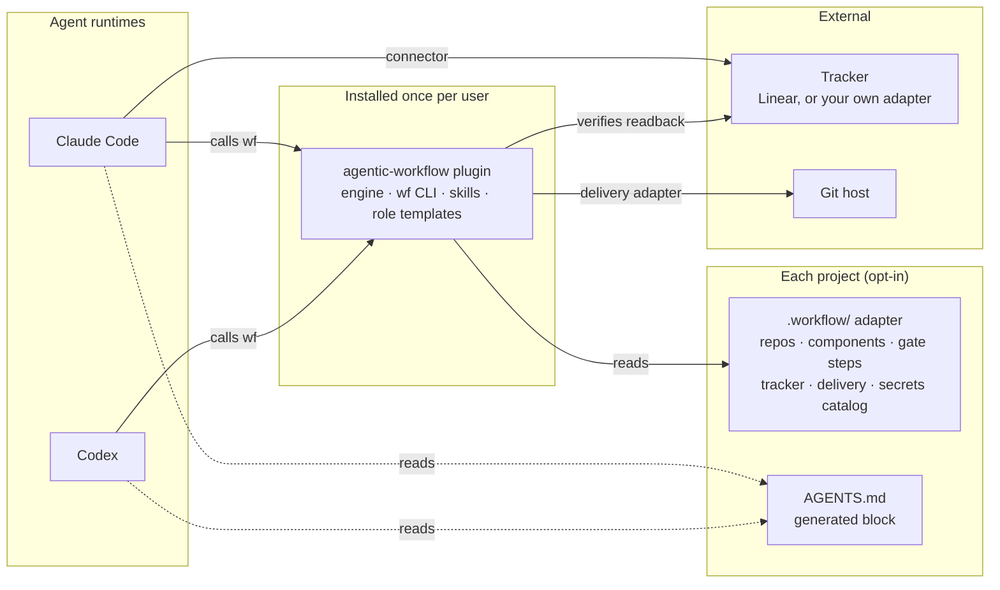
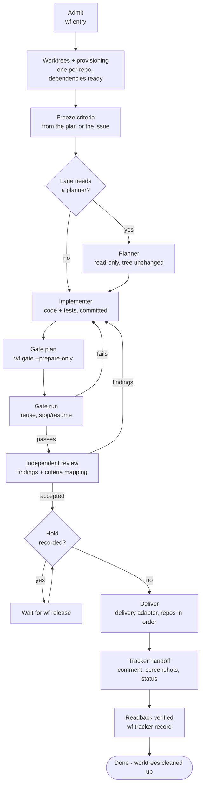
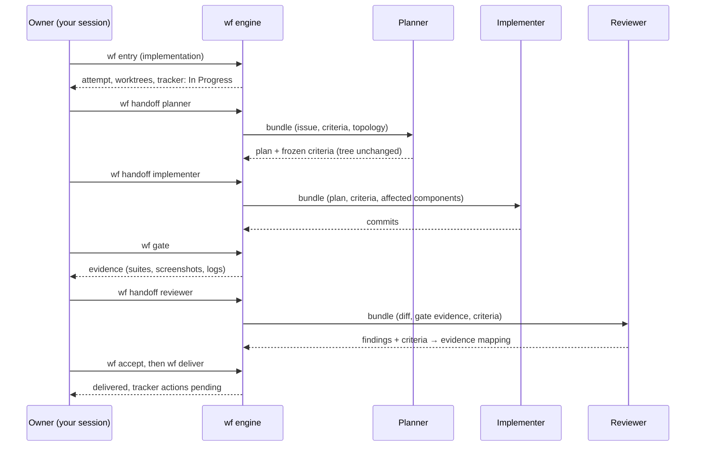
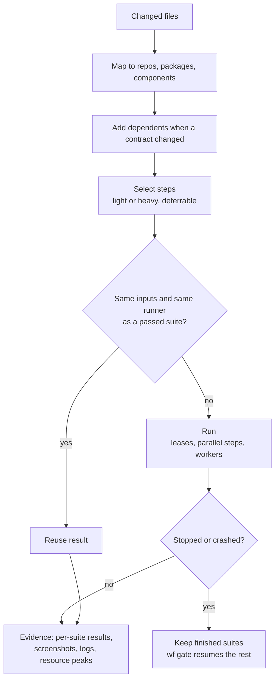
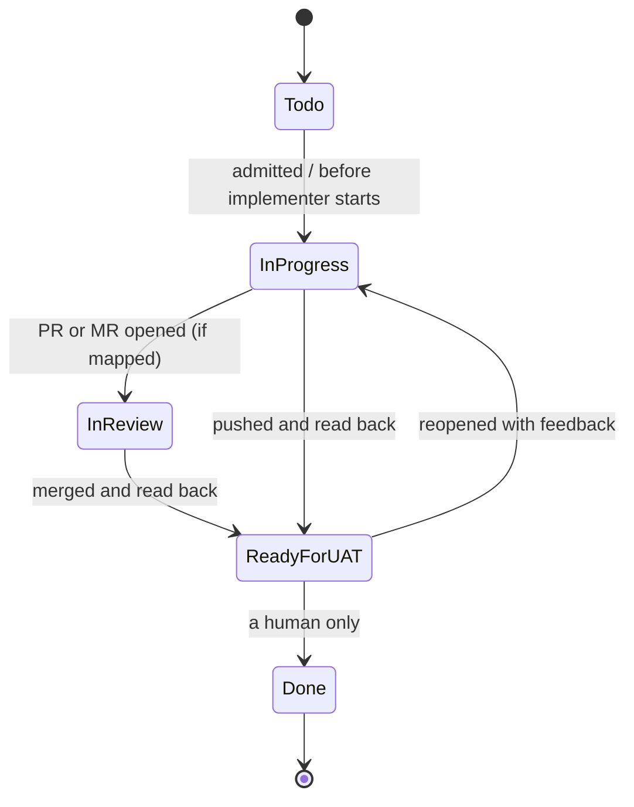
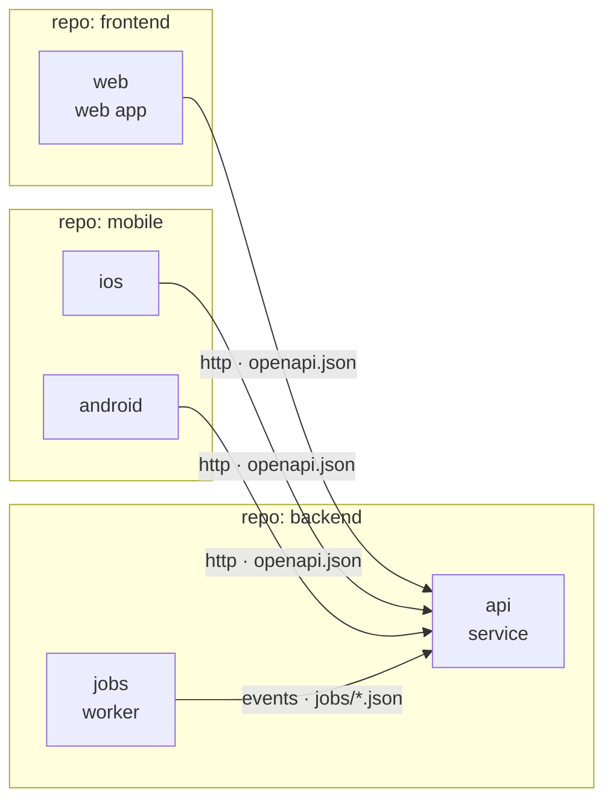
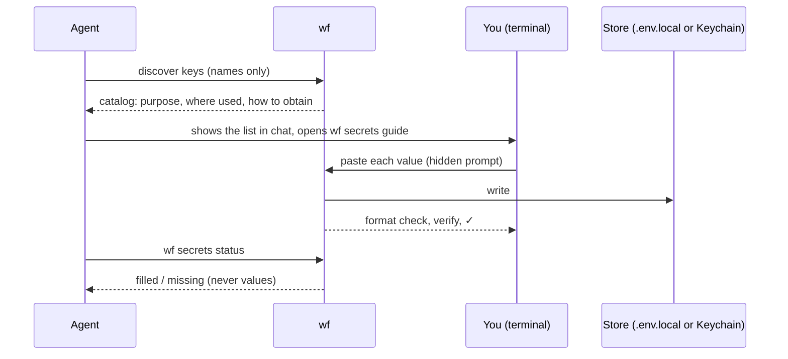

# agentic-workflow

A delivery workflow for AI coding agents, packaged as one plugin for Claude Code and Codex.

> **Status: v0.1, early.** The engine, CLI, onboarding and all three lanes work and are covered by 56 scenario tests on real git repositories, and reviewed by independent agents. It has not yet been used on a production project; expect rough edges. Design: [docs/DESIGN.md](docs/DESIGN.md). Feedback through issues is welcome.

Every change runs through the same lifecycle: a ticket is admitted, worked on in isolated worktrees, planned, implemented, proven by a gate, reviewed by an agent that did not write it, delivered, and handed back to the tracker with a readback. Each step checks evidence the engine wrote, never what an agent says it did.

## Install

Requires Node.js 20+ and git.

Claude Code:

```bash
claude plugin marketplace add o-m-a-r-k/agentic-workflow
claude plugin install agentic-workflow@agentic-workflow
```

Then put the `wf` CLI on your PATH (once). The plugin is cached under a versioned folder:

```bash
node "$(ls -d ~/.claude/plugins/cache/agentic-workflow/agentic-workflow/*/ | tail -1)bin/wf" install
```

Without a plugin system, clone the repo and run `node bin/wf install`. Supported: macOS and Linux (it needs `sh`, `git` and `ps`); Windows is not supported.

## Quick start

```bash
cd my-project            # a git repo, or a folder holding several
wf init                  # drafts .workflow/ from what it finds (disabled); review it
git add .workflow && git commit -m "Add agentic-workflow adapter" && git push
wf doctor                # proves the commands work on a clean checkout of the base
wf enable
```

Or ask your agent to "onboard this project to agentic-workflow": the `onboard` skill walks you through components, steps, tracker and secrets.

## Contents

- [Why](#why)
- [How it fits together](#how-it-fits-together)
- [The lifecycle](#the-lifecycle)
- [Lanes](#lanes)
- [Roles and handoffs](#roles-and-handoffs)
- [The gate](#the-gate)
- [Delivery and the ticket](#delivery-and-the-ticket)
- [Your system: repos and components](#your-system-repos-and-components)
- [Onboarding a project](#onboarding-a-project)
- [Secrets](#secrets)
- [Telemetry](#telemetry)
- [Principles](#principles)
- [Contributing](#contributing)

## Why

Agents write code fast. Trusting what they report is the slow part. Common failures:

- an agent says tests pass when they didn't run;
- the agent that wrote the code also reviews it;
- tests get written to match the code instead of the requirement;
- gates take an hour because everything reruns on every change;
- a crash or a laptop going to sleep throws away a finished test run;
- "delivered" means pushed, while the ticket still says In Progress.

agentic-workflow turns each of these into something the engine checks.

## How it fits together



- **Plugin:** the engine and the `wf` CLI. It knows no framework, tracker or company.
- **Adapter:** a committed `.workflow/` folder in each project. If it's missing or disabled, the plugin does nothing in that project.
- **AGENTS.md:** the only instruction file the workflow writes. Claude Code and Codex both read it.

## The lifecycle



| Step | Command | What the engine checks |
| --- | --- | --- |
| Admit | `wf entry` | Intent is `implementation` or `analysis`. Analysis can never deliver. |
| Worktrees | automatic | One worktree per repo; dependencies cloned or installed; ignored files like `.env.local` copied in. |
| Criteria | `wf plan` | Criteria are frozen before implementation. Later changes go through `wf criteria amend --reason`. |
| Plan | `wf handoff planner` | The planner leaves the tree unchanged. |
| Implement | `wf handoff implementer` | Changes are committed before the gate. |
| Gate | `wf gate` | Each step's evidence is hashed. A newer failure beats an older pass. |
| Review | `wf review`, `wf accept` | The reviewer isn't the owner, planner or an implementer. Every finding is fixed or shown to be a non-issue. Every criterion maps to evidence or a justified n/a. The tree hasn't changed since the review handoff. |
| Deliver | `wf deliver` | Implementation intent, no hold, review accepted. |
| Handoff | `wf tracker record` | The status, comment and screenshots are all read back from the tracker. |

A stopped or interrupted attempt resumes with `wf resume`, which says exactly what's next.

## Lanes


- **quick:** for small fixes. Same gate and independent review, but no planner and no tracker.
- **standard:** one ticket, the full lifecycle.
- **batch:** tickets share their heavy gate. Each ticket defers its heavy steps, the batch runs them once, then everything is delivered together and each ticket gets its own handoff.
- **focused:** a gate option, not a lane. When every changed file is in the adapter's `focused` paths, `wf gate --focused` runs only the light steps: fast proof while repairing. It never counts as the proof of a tree: review handoff, `wf accept` and `wf deliver` refuse a focused gate and name the heavy steps it skipped.

## Roles and handoffs



- Roles are agents your runtime starts: subagents in Claude Code, tasks in Codex.
- `wf sync` writes each project's role files from the plugin's templates plus the project's own additions, including the model and effort for each role.
- A separate tester role is available but off by default. Frozen criteria plus review of the gate's evidence cover the same failure with one fewer handoff.

## The gate



- **Steps are your commands,** in any language: `yarn jest`, `vendor/bin/phpunit`, `pytest`, `go test`, `gradle test`, `xcodebuild test`.
- **Per-suite results come from JUnit XML.** A plugin is only needed for what JUnit can't carry, such as screenshots or container teardown.
- **Reuse:** a suite reruns only when its inputs or its runner change. Worker counts never invalidate a pass.
- **Parallelism:** `maxParallelSteps` sets how many steps run at once. Leases (`docker`, `browser`, `simulator`) stop resource-heavy steps from colliding.
- **Workers:** `auto` sizes them from measured free memory and performance cores, never below the minimum you set.
- **Live output:** `wf gate` prints a line as each step starts and finishes (status, seconds; for a failure the first failing suite or the last 5 log lines, secrets masked), so a gate run in the background shows progress in its log. With `--json` these lines go to stderr. A failing step never stops the others. While a gate runs, `wf status` and `wf resume` show the steps running and finished.
- **Base movement:** when the base branch advances, the gate reopens only if the new commits touch the ticket's paths or shared infrastructure.

### Gate step fields

Each entry under `gate.steps` in `.workflow/project.yaml` (full example in [docs/DESIGN.md](docs/DESIGN.md#adapter-format)):

| Field | Meaning |
| --- | --- |
| `id`, `repo` or `component`, `package` | Which step, and where it runs. |
| `run` or `plugin` | The shell command, or a step plugin committed in `.workflow/`. |
| `inputs`, `ignores` | Globs the step depends on and provably does not depend on. No `inputs`: the step runs every gate. |
| `alsoInputs` | Other repos the step reads, e.g. an end-to-end step that builds a sibling repo's service. Their trees join the reuse key, so a change there reruns the step; an unreadable tree means it always runs. |
| `tier` | `light` or `heavy`. `--focused` runs light steps only. |
| `when.paths` | Run only when a changed file matches. |
| `report.junit`, `select` | Per-suite results and suite-level reruns. |
| `workers`, `shards`, `lease`, `deferrable`, `artifacts` | Sizing, resource leases, batch deferral, captured screenshots and files. |

## Delivery and the ticket



- **Delivery adapters** do the git side, in three parts:
  - `integrate`: push to main, or open a PR/MR.
  - `observe`: report states like awaiting merge or CI running.
  - `readback`: prove the change is on the target branch.

  `push-main` is built in; anything else is one file in your project.
- **Tracker adapters** map lifecycle events to status changes, comments and attachments. Linear is built in. Any other tracker, including your own product's API, is one adapter file.
- **The handoff comment** comes from your template. It describes the UAT scope in product language and never includes file paths, commits or hashes.
- **Screenshots** come only from the gate's recorded captures. They're attached to the ticket and shown in your session.
- **Pending until read back:** until the tracker readback passes, the attempt is `handoff-pending`, not done.
- **Done is yours.** The workflow never sets it.

## Your system: repos and components



At onboarding you define what your system is:

- **Repos** are git roots. **Packages** are folders inside a repo, for monorepos.
- **Components** are what runs: service, web, mobile-ios, mobile-android, worker, library, infra. The list is open.
- Each component declares what it `provides` and what it `dependsOn`, with the contract file: OpenAPI, proto, GraphQL or event schemas.

The engine uses this to:
- pull dependents into the gate when a contract changes;
- deliver providers before consumers;
- tell the reviewer which contracts a change crosses.

## Onboarding a project


- `wf enable` / `wf disable` turn the workflow on or off for a project at any time.
- **Skills** the roles need are copied into the project when their license allows, so every agent on every runtime applies the same version.
- `wf topology` shows when the code has drifted from the committed component graph.

## Secrets



- **Agents never see a secret value.** They see key names only.
- **Generated keys** (signing secrets, local database passwords) are created for you.
- **Test values** come from the project's example files.
- **Masking:** every catalogued value is masked in logs, evidence and telemetry.

## Telemetry

- **Engine events:** every `wf` command records phase, role, step, suite, status, reuse, duration and resource peaks.
- **Agent usage:** the model, tokens, time and tool calls for each role are read from the runtime's own session logs after the fact. This is measurement only; it never allows or blocks anything.
- **`wf status --all`** shows open work across every enabled project.
- **`wf report`** shows where time and tokens go: by phase, step, role and model, with reuse rate and repair rounds.

## Principles

1. Authority to deliver comes from an admitted implementation intent with no hold. Nothing is inferred from prompts.
2. Every step checks evidence the engine wrote, never an agent's claim.
3. The reviewer never wrote or planned the change.
4. Criteria are frozen before code. Each one maps to evidence, not necessarily to a new test.
5. Gates are fast through reuse, not by skipping.
6. Interruptions keep finished work.
7. Delivery isn't a push: it ends with a verified tracker handoff.
8. Every refusal, limit or check names the failure it catches.
9. Agents never handle secrets.
10. The engine stays framework- and tracker-agnostic. Specifics live in adapters.

## Contributing

See [CONTRIBUTING.md](CONTRIBUTING.md). Security issues go through [SECURITY.md](SECURITY.md).

## License

[MIT](LICENSE)
