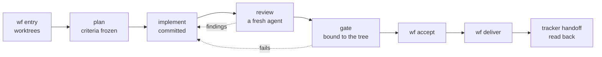

# agentic-workflow

**Your agent says the tests passed. wf makes it prove it.**

[](CHANGELOG.md)
[](https://github.com/o-m-a-r-k/agentic-workflow/actions/workflows/ci.yml)
[](LICENSE)

Coding agents are fast; checking what they report is the slow part. agentic-workflow is a delivery workflow for Claude Code and Codex, and every "done" it reports comes with a receipt: a hash-chained ledger of which tree the gate ran on and which steps it reused, who reviewed the change (never its author, checked from the agent transcripts where they exist), what they found, and the tracker's own readback of the handoff. The `wf` CLI is the only thing that writes that record; agents can say anything, and wf accepts only what its engine recorded.

> **Status: v0.4, early.** The engine, CLI, onboarding, three lanes and three built-in trackers (Linear, GitHub Issues, tickets as files) are covered by scenario tests on real git repositories, run on macOS and Linux in CI (the badge above). It has not been proven on a production project yet; expect rough edges and breaking changes before 1.0. [Changelog](CHANGELOG.md) · [design](docs/DESIGN.md).

## See it


The recording is real `wf` output from [`examples/hello-ticket`](examples/hello-ticket/) ([plain text](docs/assets/demo.txt)); run it yourself with the command under [Try it](#try-it-in-5-minutes).

## The problem

An agent's report is a claim. The failures that cost the most time are the ones a claim hides:

- the agent says the tests pass, but they never ran on the code being shipped;
- the agent that wrote the change also reviews it, or a reviewer is steered to look away;
- "delivered" means pushed, while the ticket still says In Progress and nobody looked at the screenshots.

wf turns each of these into something the engine checks and refuses.

## What wf checks

| Failure | What wf refuses | Evidence it keeps |
| --- | --- | --- |
| Tests "passed" but never ran on this code | `wf accept` and `wf deliver` without a passing full gate on the current tree (a `--focused` or older pass does not count) | Each step's log and JUnit results, bound to the tree hash |
| The author reviews its own change | `wf handoff reviewer` for the owner, planner, an implementer or an earlier round's reviewer; `wf review` when the transcript shows another agent type or a different prompt | The handoff, the bundle the reviewer got, the closure as written, provenance status |
| Criteria bent to fit the code | Changes to frozen criteria without `wf criteria amend --reason` | The raw plan and every amendment with its reason |
| Gates rerun everything, or reuse a stale pass | Reuse when a step's inputs, runner or a sibling repo it reads (`alsoInputs`) changed | Per-step reuse keys and the run each result came from |
| Screenshots nobody looked at | Acceptance until the reviewer lists the sha256 of every capture; the handoff until the owner captions each one (`wf shown`) | The delivered set, the owner's captions and the anomalies seen |
| "Delivered" while the ticket says In Progress | Closing the attempt until the tracker's readback shows the status, the rendered comment and every screenshot | The raw tracker capture, or the engine's own readback |
| Evidence edited after the fact | Any command on an attempt whose files, ledger chain or anchor differ from what the engine recorded | A hash-chained ledger and a manifest of every evidence file, verified at every use |

## Install

Requires Node.js 20+ and git, on macOS or Linux (it needs `sh`, `git` and `ps`); Windows is not supported.

```bash
claude plugin marketplace add o-m-a-r-k/agentic-workflow
claude plugin install agentic-workflow@agentic-workflow
# put the wf CLI on your PATH, once (the plugin is cached under a versioned folder)
node "$(ls -d ~/.claude/plugins/cache/agentic-workflow/agentic-workflow/*/ | tail -1)bin/wf" install
```

For Codex, or without a plugin system: clone this repository and run `node bin/wf install`; `wf sync` writes the role agents for both runtimes into each project.

## Try it in 5 minutes

```bash
git clone https://github.com/o-m-a-r-k/agentic-workflow && cd agentic-workflow
bash examples/hello-ticket/demo.sh
```

No install, key, model or network needed: a tiny library with two tickets as files and `node --test` as the gate, run in a temporary folder that is removed afterwards (`KEEP=1` keeps it). You should see the gate refuse the first implementation (`exit 1: refused`), the implementer refused as its own reviewer (`exit 75: refused`), a fresh review, `delivered HT-1.1`, and the ticket file at `status: Ready for UAT` with the rendered comment. Plain shell stands in for the agents. Then onboard your own project:

```bash
cd my-project && wf init      # drafts .workflow/ from what it finds (disabled); review it
git add .workflow && git commit -m "Add agentic-workflow adapter" && git push
wf doctor && wf enable        # proves the steps on a clean checkout of the base first
```

Or ask your agent to "onboard this project to agentic-workflow".

## How it works



1. **Admit:** `wf entry` opens an attempt with one git worktree per repo and moves the ticket to In Progress.
2. **Plan:** a read-only planner's criteria are frozen before any code exists.
3. **Implement:** implementers commit in the worktrees, one per work item if needed.
4. **Review:** a newly started agent, given one line, reviews the committed change against the criteria.
5. **Gate:** your own test commands run; unchanged steps are reused, and the result is tied to the exact tree.
6. **Accept and deliver:** only a passing gate and a clean closure on the current tree open delivery (a push to main, or a PR through a delivery adapter).
7. **Hand off:** the ticket gets the status, a comment rendered from your summary and the captioned screenshots; the attempt closes only when the readback confirms them.

Lanes (quick, standard, batch), roles, work classes and the gate are described in the [docs](#docs).

## Trust model, in short

- **Enforced:** the ledger and its chain, gate results bound to the tree and the adapter committed at base, frozen criteria, reviewer independence, acceptance only on the current tree, the tracker readback.
- **Relies on you:** agent names are what the owner supplies, and a reviewer must be a newly started agent given only the printed line; the engine cannot see the prompt a runtime gives it.
- **Does not stop:** a determined process running as your user can rewrite everything consistently. wf catches mistakes, not attacks. [Full trust model](docs/trust-model.md).

## How it compares, and when not to use it

- **A bare agent loop** reports what it did; nothing records it. wf adds the record and the refusals, and costs a few extra commands per ticket.
- **Spec and methodology kits** guide what the agent does; wf checks what it did. They combine: a kit's skills can be required per role (`requires.skills`).
- **CI** checks a pushed commit. wf checks before the push: the claim, the reviewer and the ticket. Its gates run on your machine, so it works without CI and can sit in front of it.

Don't use it for:

- Windows.
- Work outside git.
- Throwaway scripts where a review round costs more than a mistake.
- A hard security boundary against a hostile agent.
- A tracker other than Linear, GitHub Issues or files, unless you are willing to write a small adapter.
- A hosted dashboard: wf is a local CLI and files.

## Docs

| Page | What is in it |
| --- | --- |
| [Concepts](docs/concepts.md) | Terms, how the parts fit together, principles |
| [Lifecycle](docs/lifecycle.md) | Every step and command, lanes, roles and handoffs, work classes |
| [Gate and evidence](docs/gate.md) | Step fields, per-ticket evidence, reuse, scope, review rules, design-system checks, evidence integrity, the guard hook |
| [Delivery and tracker](docs/delivery-and-tracker.md) | Delivery adapters, trackers (kind × via, what each can verify), the delivered comment, screenshots |
| [Onboarding and secrets](docs/onboarding.md) | Install details, repos and components, `wf init`, engine pin, secrets |
| [Adapter schema](docs/adapter.md) | `.workflow/project.yaml` with a full example, the step plugin contract |
| [Lessons and improvements](docs/lessons-and-improvements.md) | How a project learns from corrections, and how workflow findings reach the plugin ([design](docs/LESSONS.md)) |
| [Trust model](docs/trust-model.md) | What is enforced, what relies on you, what is not stopped |
| [Telemetry](docs/telemetry.md) | What `wf report` measures (measurement only) |
| [Scenarios](docs/SCENARIOS.md) | The demo, the game day, every behaviour scenario |
| [Design](docs/DESIGN.md) | The full design and its open questions |

## Contributing, security, license

Contributions are welcome: see [CONTRIBUTING.md](CONTRIBUTING.md) (every fix comes with a scenario test; `npm run verify` runs the suite on your machine and in a Linux container). Report security issues privately as described in [SECURITY.md](SECURITY.md). [MIT](LICENSE).
