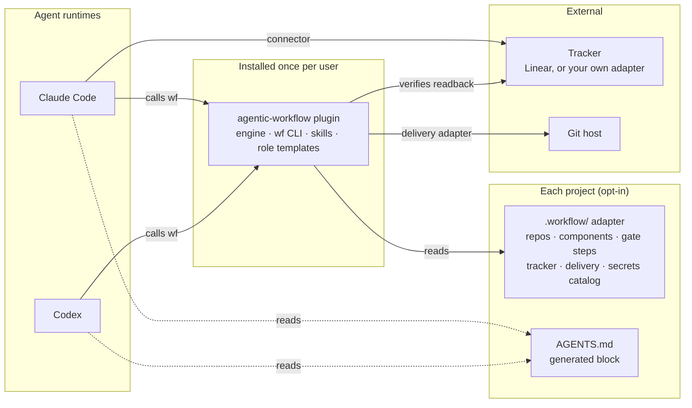
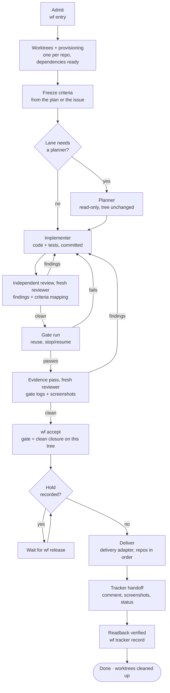
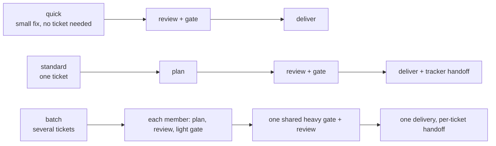
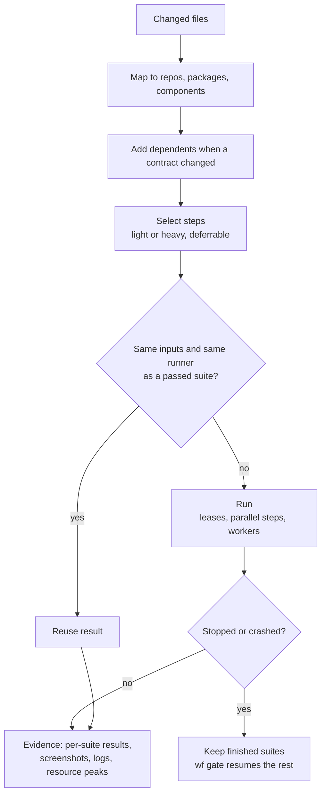
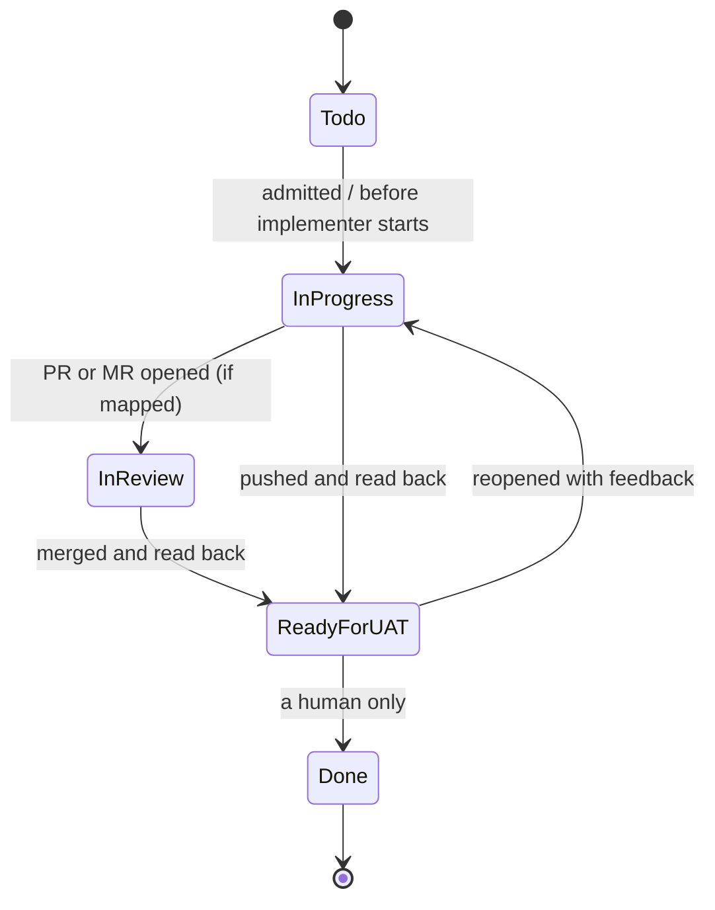
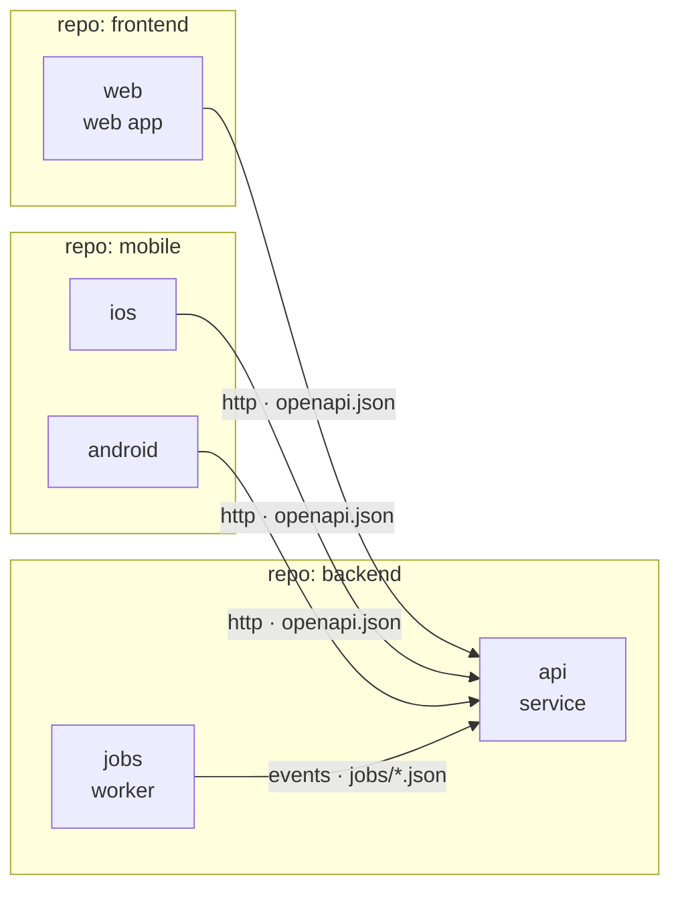
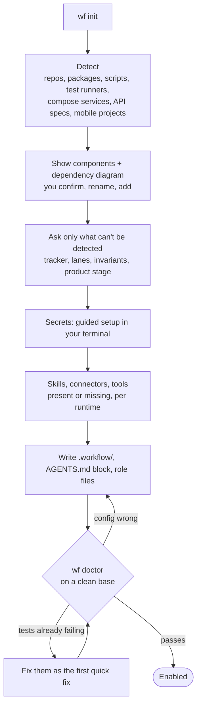
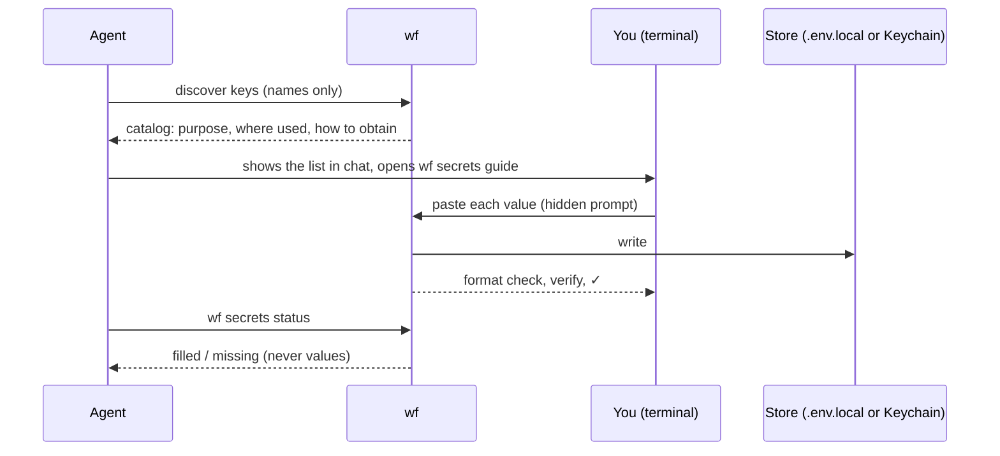

# agentic-workflow

A delivery workflow for AI coding agents, packaged as one plugin for Claude Code and Codex.

> **Status: v0.1, early.** The engine, CLI, onboarding and all three lanes work and are covered by 113 scenario tests (including a game day that runs one ticket through every fault seen on real tickets) on real git repositories, and reviewed by independent agents. It has not yet been used on a production project; expect rough edges. Design: [docs/DESIGN.md](docs/DESIGN.md). Feedback through issues is welcome.

Every change runs through the same lifecycle: a ticket is admitted, worked on in isolated worktrees, planned, implemented, proven by a gate, reviewed by an agent that did not write it, delivered, and handed back to the tracker with a readback. Each step checks evidence the engine wrote, never what an agent says it did.

## Install

Requires Node.js 20+ and git.

Claude Code:

```bash
claude plugin marketplace add o-m-a-r-k/agentic-workflow
claude plugin install agentic-workflow@agentic-workflow
```

Then put the `wf` CLI on your PATH (once). The plugin is cached under a versioned folder:

```bash
node "$(ls -d ~/.claude/plugins/cache/agentic-workflow/agentic-workflow/*/ | tail -1)bin/wf" install
```

Without a plugin system, clone the repo and run `node bin/wf install`. Supported: macOS and Linux (it needs `sh`, `git` and `ps`); Windows is not supported.

## Quick start

```bash
cd my-project            # a git repo, or a folder holding several
wf init                  # drafts .workflow/ from what it finds (disabled); review it
git add .workflow && git commit -m "Add agentic-workflow adapter" && git push
wf doctor                # proves the commands work on a clean checkout of the base
wf enable
```

Or ask your agent to "onboard this project to agentic-workflow": the `onboard` skill walks you through components, steps, tracker and secrets.

## Contents

- [Why](#why)
- [How it fits together](#how-it-fits-together)
- [The lifecycle](#the-lifecycle)
- [Lanes](#lanes)
- [Roles and handoffs](#roles-and-handoffs)
- [Work classes](#work-classes)
- [The gate](#the-gate)
- [Delivery and the ticket](#delivery-and-the-ticket)
- [Your system: repos and components](#your-system-repos-and-components)
- [Onboarding a project](#onboarding-a-project)
- [Secrets](#secrets)
- [Telemetry](#telemetry)
- [Trust model](#trust-model)
- [Principles](#principles)
- [Contributing](#contributing)

## Why

Agents write code fast. Trusting what they report is the slow part. Common failures:

- an agent says tests pass when they didn't run;
- the agent that wrote the code also reviews it;
- tests get written to match the code instead of the requirement;
- gates take an hour because everything reruns on every change;
- a crash or a laptop going to sleep throws away a finished test run;
- "delivered" means pushed, while the ticket still says In Progress.

agentic-workflow turns each of these into something the engine checks.

## How it fits together



- **Plugin:** the engine and the `wf` CLI. It knows no framework, tracker or company.
- **Adapter:** a committed `.workflow/` folder in each project. If it's missing or disabled, the plugin does nothing in that project.
- **AGENTS.md:** the only instruction file the workflow writes. Claude Code and Codex both read it.

## The lifecycle



| Step | Command | What the engine checks |
| --- | --- | --- |
| Admit | `wf entry` | Intent is `implementation` or `analysis`. Analysis can never deliver. |
| Worktrees | automatic | One worktree per repo; dependencies cloned or installed; ignored files like `.env.local` copied in. |
| Criteria | `wf plan --from-agent <planner id>` | Criteria and every plan section are frozen before implementation, taken from the planner's transcript unchanged; unknown top-level keys are refused. Later changes go through `wf criteria amend --reason`. |
| Plan | `wf handoff planner` | The planner leaves the tree unchanged. |
| Implement | `wf handoff implementer` | Changes are committed before review and the gate. |
| Review | `wf handoff reviewer`, `wf review` | Allowed once the work is committed, before or during the gate. The reviewer isn't the owner, planner, an implementer or a reviewer of an earlier round. Where transcripts exist, its transcript must show the agent type handed and exactly the printed start line. The closure is bound to the tree it was handed; earlier rounds' open findings are revealed only after it, for verification. |
| Gate | `wf gate` | Each step's evidence is hashed. A newer failure beats an older pass. |
| Accept | `wf accept` | On the current tree: a passing full gate, a closure with every finding fixed or shown to be a non-issue, written after that gate passed (an evidence pass when the review came first). Every criterion maps to evidence or a justified n/a. |
| Deliver | `wf deliver` | Implementation intent, no hold, review accepted. |
| Shown | `wf shown` | Every delivered screenshot shown to the owner with a caption the owner wrote; nothing owed when none were delivered. |
| Handoff | `wf tracker record` | The status, comment and every delivered screenshot (as an uploaded file with its caption) are read back from the tracker. |

A stopped or interrupted attempt resumes with `wf resume`, which says exactly what's next. With more than one open attempt, every command it prints carries `--attempt <id>`.

### The plan file

`wf plan --from-agent <planner id>` reads the planner's last ```` ```yaml ```` block from its Claude Code subagent transcript (found by the name it was started with), so the owner never retypes it. `wf plan --file <file>` takes the same YAML from a file. The plan sections (`summary`, `contract`, `anchors`, `tests`, `doNotRun`, `externalServices`, `agentSplit`) may sit under `plan:` or at the top level beside `criteria` and `work`; `plan:` may also be plain text (the summary). Any other top-level key is refused with the list of known ones, because a section the engine does not read never reaches the implementers. Every section is stored in the frozen plan and handed to the implementers and reviewers in their bundles.

### Durable artifacts and the attempt page

Everything an agent or the owner produced is kept verbatim, write-once and hash-bound in `.wf-evidence/attempts/<id>/` at the moment the engine consumes it: the raw plan (`plans/plan-1.raw.yaml`, or `.json`), every amendment file (`plans/amend-<n>.raw.*`), every closure as written (`review/closure-<round>.raw.json`), the handoff bundles, gate results and tracker captures. Nothing exists only in chat.

`wf export [--attempt id] [--out file]` writes one self-contained HTML page (no external requests, light and dark, phone width) for the attempt at any phase: item and phase, every plan section, work items with class and agents, criteria with each amendment and its reason, handoffs, review rounds with findings, gate and check runs per step, the last gate's evidence per artifacts glob (expanded, with matched files, or none for this ticket), flakes, tracker events, delivery, and the delivered screenshots embedded as images (only the delivered set, each checked against its sha256, with the owner's caption or the proposal marked as such; click to enlarge). `--json` prints the same data. Catalogued secrets are masked. The page is a view; the ledger and evidence are the source of truth. `wf resume` prints the path of the latest export and warns when the frozen plan has no `contract` or `anchors`.

### Base movement

`wf status` and `wf resume` fetch each repo's base (a failed fetch is noted, never an error) and say `base moved: N commits` and whether it overlaps the files the ticket changed. `wf base merge` merges the base into each worktree: it refuses a dirty tree or a running gate, aborts a conflicting merge so the worktree is left as it was, records a ledger event, and notes when the merged commits touch the ticket's files. A merge that moves HEAD leaves the gate and the review without a pass for the new tree (both are bound to it): run `wf gate` and a fresh reviewer. Delivery still merges a moved base itself and reopens the gate only when it overlaps.

## Lanes



- **quick:** for small fixes. Same gate and independent review, but no planner and no tracker.
- **standard:** one ticket, the full lifecycle.
- **batch:** tickets share their heavy gate. Each ticket defers its heavy steps, the batch runs them once, then everything is delivered together and each ticket gets its own handoff.
- **focused:** a gate option, not a lane. When every changed file is in the adapter's `focused` paths, `wf gate --focused` runs only the light steps: fast proof while repairing. It never counts as the proof of a tree: `wf accept` and `wf deliver` refuse a focused gate, a reviewer handed a focused-gated tree is told no gate passed on it, and name the heavy steps it skipped.

## Roles and handoffs

```mermaid
sequenceDiagram
  participant O as Owner (your session)
  participant WF as wf engine
  participant PL as Planner
  participant IM as Implementer
  participant RV as Reviewer
  O->>WF: wf entry (implementation)
  WF-->>O: attempt, worktrees, tracker: In Progress
  O->>WF: wf handoff planner
  WF->>PL: bundle (issue, criteria, topology)
  PL-->>WF: plan + frozen criteria (tree unchanged)
  O->>WF: wf handoff implementer
  WF->>IM: bundle (plan, criteria, affected components)
  IM-->>WF: commits
  O->>WF: wf handoff reviewer (gate may run in parallel)
  WF->>RV: bundle (diff, criteria; no gate evidence yet)
  RV-->>WF: findings + criteria → evidence mapping
  O->>IM: fix findings (same implementer), commit
  O->>WF: wf gate
  WF-->>O: evidence (suites, screenshots, logs)
  O->>WF: wf handoff reviewer (new agent: evidence pass)
  WF->>RV: bundle (diff, criteria, gate evidence)
  RV-->>WF: closure, screenshots inspected
  O->>WF: wf accept, then wf deliver
  WF-->>O: delivered, tracker actions pending
```

- Roles are agents your runtime starts: subagents in Claude Code, tasks in Codex.
- `wf sync` writes each project's role files from the plugin's templates plus the project's own additions. Effort and model come from [work classes](#work-classes): one implementer agent per class, and the planner and reviewer at their role's class.
- **Planner** returns the plan as a short checklist: summary, the cross-repo contract (routes, DTO fields, error codes, permission subjects), anchors (file:line of each function to change), tests to write and the targeted selectors to run, suites not to run, the external-services policy (default runs need no provider keys or internet) and the agent split (what can proceed in parallel once the contract is committed).
- **Implementers** can run in parallel, one per work item (or per repo or area), after the contract is committed (`wf handoff implementer` accepts several; `--work W1` hands over one work item and prints the agent type to start). They run only the specs they changed while iterating, then the repo's lint and full unit suite once before finishing; the gate runs the rest.
- **Reviewer** is started blind and fresh: `wf handoff reviewer` prints one line (the bundle path), and that line is its whole prompt, with no hints, summaries, focus areas or earlier findings. Every round is a new agent with a new id; the engine refuses an id that reviewed an earlier round of the attempt, because a resumed reviewer is anchored on what it found before. Each round reviews the whole attempt against the frozen criteria. The bundle holds the criteria, amendments with reasons, the plan, the diff's worktrees and bases, and says whether a gate passed on this tree (with its logs and screenshots when one did). It is never the planner or an implementer.
- **Review order:** review comes before the gate, because each finding found after a full gate costs another full gate. Hand the committed change to a reviewer, fix its findings, gate the fixed tree, then a fresh reviewer does the evidence pass (gate logs and screenshots) and `wf accept`. The owner may start the review and the gate together (never editing the worktrees while the gate runs). Review first when findings are likely (money, authorization, migrations); both together when findings are rare, so a clean review and a passing gate leave only the evidence pass.
- **Role appendices:** `roles.<role>.appendix` in the adapter names a file under `.workflow/` whose text `wf sync` appends to that role's generated agent under "Project additions". Role agents generated while a session runs register only after it restarts; start the agent type `wf handoff` names, never a general-purpose agent, and never pass a model on the spawn (both override the agent file's effort and model).
- **Amending criteria:** `wf criteria amend --file f --reason "why"` merges by criterion id. Criteria in the file replace the frozen ones with the same id, a new id is added, and every id the file does not mention stays as it was. Removing one takes an explicit `{ id: C3, dropped: true, reason: "..." }` entry. The command prints the full list after the change and what changed, added or dropped. Adding by listing a new id is safe because nothing is lost: a mistyped id adds a criterion the reviewer must map rather than removing one.
- A separate tester role is available but off by default. Frozen criteria plus review of the gate's evidence cover the same failure with one fewer handoff.

## Work classes

A work class says how hard an agent thinks on a kind of work. The planner groups the criteria into work items and gives each one a class; `wf handoff implementer --work W1` then names the agent generated for that class (`wf-implementer` for the implementer role's class, `wf-implementer-<class>` for every other), whose file sets the effort and, if configured, the model.

| Class | Default `use` text | Claude effort | Codex effort |
| --- | --- | --- | --- |
| `full` | Money, payments, audit, authorization, tenant isolation, migrations, external protocols, and anything the project's invariants file calls a critical boundary. | high | inherited |
| `light` | UI wired to a frozen contract, translations, generated docs or OpenAPI output, test fixtures. | low | inherited |

- Any work item that touches something `full` covers is `full`. The planner and the reviewer run at `full` unless the project changes their role's class; the implementer role's own class (default `full`) is used when a handoff names no work item.
- Model is unset by default, so the agent inherits the session's model. **Pin it** with `classes.<name>.claude.model` (and `codex.model`) when you compare classes or efforts: one effort comparison was confounded because the owner's session switched model and every unpinned agent followed. `wf doctor` warns when no class pins a model and an attempt shows more than one observed model; `wf report` shows the session model recorded at each handoff.
- The default effort values are starting points, not measurements. `wf report` shows the declared effort next to the effort observed in each agent's transcript; a difference is shown, never enforced.
- **Classes change effort only.** The gate, the blind independent review, frozen criteria, evidence integrity and the hash-chained ledger are identical for every class. A light work item gets the same gate and the same full-class reviewer as a full one.
- An implementer whose work turns out to touch something a stronger class covers stops and tells the owner.
- The list is open: add classes or override the defaults in the adapter (entries merge with the defaults by name). Claude effort is one of `low`, `medium`, `high`, `xhigh`, `max`; Codex effort is one of `minimal`, `low`, `medium`, `high`, `xhigh`. Those are the values each runtime documents today, checked so a typo fails at load; a new runtime value needs a plugin update. An unknown class anywhere (a role, a work item) is refused with the list of known classes.

A web SaaS with a backend and a web app, adding a class for copy changes:

```yaml
classes:
  full:
    use: Billing, invoices and payment webhooks; permissions and workspace isolation; database migrations; OAuth and public API contracts.
  light:
    use: Screens wired to an already-merged API contract, translation files, generated API docs, test fixtures and seed data.
  copy:
    use: Marketing pages and in-app wording with no logic change.
    claude: { effort: low }
    codex: { effort: minimal }
roles:
  planner: { class: full }
  reviewer: { class: full }
  implementer: { class: full }
```

A small single-repo library, where most work is ordinary and only the public API needs the strongest agent:

```yaml
classes:
  full:
    use: The public API surface, serialization formats, and anything semver depends on.
    claude: { effort: xhigh }
  standard:
    use: Internal changes behind an unchanged public API.
    claude: { effort: medium }
  light:
    use: Docs, examples and test fixtures.
roles:
  implementer: { class: standard }
```

## The gate



- **Steps are your commands,** in any language: `yarn jest`, `vendor/bin/phpunit`, `pytest`, `go test`, `gradle test`, `xcodebuild test`.
- **Per-suite results come from JUnit XML.** A plugin is only needed for what JUnit can't carry, such as screenshots or container teardown.
- **Reuse:** a suite reruns only when its inputs or its runner change. Worker counts never invalidate a pass.
- **Parallelism:** `maxParallelSteps` sets how many steps run at once. Leases (`docker`, `browser`, `simulator`) stop resource-heavy steps from colliding.
- **Workers:** `auto` sizes them from measured free memory and performance cores, never below the minimum you set.
- **Live output:** `wf gate` prints a line as each step starts and finishes (status, seconds; for a failure the first failing suite or the last 5 log lines, secrets masked), so a gate run in the background shows progress in its log. With `--json` these lines go to stderr. A failing step never stops the others. While a gate runs, `wf status` and `wf resume` show the steps running and finished.
- **Base movement:** when the base branch advances, the gate reopens only if the new commits touch the ticket's paths or shared infrastructure.

### Gate step fields

Each entry under `gate.steps` in `.workflow/project.yaml` (full example in [docs/DESIGN.md](docs/DESIGN.md#adapter-format)):

| Field | Meaning |
| --- | --- |
| `id`, `repo` or `component`, `package` | Which step, and where it runs. |
| `run` or `plugin` | The shell command, or a step plugin committed in `.workflow/`. |
| `inputs`, `ignores` | Globs the step depends on and provably does not depend on. No `inputs`: the step runs every gate. |
| `alsoInputs` | **Required for any step that builds, starts or reads a sibling repo** (an end-to-end step that runs the API from `../api`, a contract test reading `$WF_ROOT/web`). Their trees join the reuse key, so a change there reruns the step; an unreadable tree means it always runs. Without it, a passing step is reused after the sibling changed: one portal end-to-end pass was reused against old API code. `wf doctor` warns when a step's command references another repo's path without listing it. |
| `tier` | `light` or `heavy`. `--focused` runs light steps only. |
| `when.paths` | Run only when a changed file matches. |
| `report.junit`, `select` | Per-suite results and suite-level reruns. |
| `workers`, `shards`, `lease`, `deferrable` | Sizing, resource leases, batch deferral. |
| `artifacts` | Globs of screenshots and files the step writes that count as this ticket's evidence. Placeholders `{item}` (the tracker id as given, `ENG-12`), `{itemLower}` (`eng-12`) and `{attempt}` (`ENG-12.1`) are expanded per attempt (for a batch, once per member too); any other `{name}` is refused. See [Per-ticket evidence](#per-ticket-evidence). |

`sharedInfra` (per package) lists files whose change reruns every step of the package. Keep it to real infrastructure (lockfiles, root build config): a broad glob such as `scripts/**` makes every edit to a data file under it rerun everything.

### Per-ticket evidence

Every screenshot a step's `artifacts` globs match on a gate run is evidence the reviewer must inspect (`wf accept` refuses until each sha256 is in `screenshotsInspected`). A glob without a placeholder (`e2e/.results/**/*.png`) matches everything the whole suite wrote: a real ticket was refused with 1,300 screenshots from other tickets' specs, none of them its own. The convention:

- The project's UI tests write a ticket's evidence under a ticket folder (for example `e2e/.evidence/eng-12/…`, from the spec that covers that ticket), and the adapter points `artifacts` there: `e2e/.evidence/{itemLower}/**/*.png`. `wf init` drafts exactly that for Playwright (under its `testDir`) and Cypress (under `cypress/`), and no artifacts for other runners.
- Every step gets `WF_ITEM` (the attempt's item as given, `ENG-12`) and `WF_ITEMS` (space-separated items of the run: the attempt, and for a batch every member). They decide WHICH captures the tests make (for example, a spec writes its screenshots only when its ticket is in `WF_ITEMS`). WHERE they are written stays the project's convention, the spec's own ticket folder: a helper must not default every capture's folder from `WF_ITEM`, or every old spec's captures land in the current ticket's folder and become owed evidence again.
- A step whose package the ticket did not change owes nothing when its globs match nothing. A step whose globs matched nothing although the ticket changed files in its package is marked `uncovered` in the bundle (with `changedHere`): the reviewer gives a verdict, `noEvidence: [{ "step": "e2e", "reason": "why no capture is needed" }]` in the closure, or a finding that names the step. `wf accept` refuses an uncovered step without one; the verdicts are ledgered with the acceptance and shown by `wf export`. Named failure: a UI-changing ticket whose tests wrote no capture passed as "no screenshots for this ticket" and nothing flagged it.
- Every file that is matched must still be inspected. The reviewer bundle's `gate.artifacts` lists, per step and glob (as declared and as expanded), the matched files with their sha256; nothing outside the expanded globs is ever required. A criterion mapped to `kind: screenshot` must name one of those files (its sha256 or source path); `wf accept` refuses any other ref.
- The adapter is read at the attempt's base, so fix the globs on the base branch before the next ticket, not mid-attempt.
- `wf doctor` warns, from the adapter alone, on every glob without a placeholder; prints each glob's matched count from the most recent gate; and warns when such a glob matched files there and that ticket changed nothing under the glob's directory.

### Light checks, flakes and repair reruns

- **`wf check [--repo r]`** runs the adapter's light steps for the attempt's repos (only the named repos need to be committed). It is the implementer's definition of done: the bundle lists the exact steps and the command. Its results use the gate's keys, so the full gate reuses them, but a check never counts as a gate for acceptance or delivery.
- **Scheduling:** the gate starts light steps first, then heavy steps longest first (by their last recorded duration), so wall time is not the heavy steps run in adapter order and light failures show early.
- **Flakes:** a step that failed and then passed with the same key (same inputs and runner) is recorded as `gate.flaky`, with the suites that flipped; `wf status` and the reviewer bundle show it.
- **Suite-level reruns:** declare `report: { junit: <path> }` and `select: "<how the runner takes files>"` (for example `select: "--runTestsByPath {suites}"` for Jest, `select: "{suites}"` for a runner that takes paths) and put `{select}` in `run`. A failing step then reruns only its failed or changed suites; passing suites are carried.
- **`wf gate --rerun-failed`** runs only the steps that failed last time (reusing what still passes). Like `--focused`, it is proof while repairing and never counts.

### Scope

Bundles list `outsidePlan`: changed files that no plan anchor or test path names (an implementer once changed audit-read code outside the plan). The reviewer may add a verdict per file; `wf status` shows the count. It never blocks.

### Leases for agents' own stacks

`wf run --lease docker -- docker compose up --wait` runs a command holding the same machine-wide slot a gate step with `lease: docker` takes, waiting while every slot is held, and frees it when the command exits. Implementers start docker stacks and browsers this way so concurrent attempts never exceed `gate.leases`.

### Step environment

Steps, provisioning (`install`, `onWorktreeCreate`), `wf doctor` checks and secret `verify` commands get an allowlisted environment, not the owner's whole one: the toolchain variables in `engine/env.mjs` (`PATH`, `HOME`, `USER`, `SHELL`, `LANG`/`LC_*`, `TERM`, `TMPDIR`, `TZ`, `CI`, `NODE_OPTIONS`, `XDG_*`, `SSH_AUTH_SOCK`, `DOCKER_*`, `COMPOSE_*`, `npm_config_*`, `NVM_*`, `JAVA_HOME`, `VIRTUAL_ENV`, `PYENV_*`, `GOPATH`, `CARGO_HOME`, `RUSTUP_HOME`, proxies and CA bundles, and more), every `WF_*` variable, and the catalogued secrets a step lists in `usedBy`. Add project variables with names or `*` prefixes:

```yaml
gate:
  env:
    pass: [PLAYWRIGHT_BASE_URL, MYAPP_*]
```

The engine sets `WF_ROOT`, `WF_ATTEMPT`, `WF_ITEM`, `WF_ITEMS`, `WF_STEP`, `WF_EVIDENCE`, `WF_WORKERS` (and `WF_SHARD`/`WF_SHARDS` per shard) for every step; see [Per-ticket evidence](#per-ticket-evidence) for `WF_ITEM(S)`.

Agent-runtime variables (`CLAUDE_CODE_*`, `ANTHROPIC_*`, `CODEX_*`, `OPENAI_*`, `GROK_*`, `XAI_*`) never reach a step unless `pass` names that family itself (`ANTHROPIC_BASE_URL`, `ANTHROPIC_*`); a broad prefix such as `C*` does not count. Step plugins get the filtered environment as `ctx.env`, but they run inside the `wf` process.

## Delivery and the ticket



- **Delivery adapters** do the git side, in three parts:
  - `integrate`: push to main, or open a PR/MR.
  - `observe`: report states like awaiting merge or CI running.
  - `readback`: prove the change is on the target branch.

  `push-main` is built in; anything else is one file in your project.
- **Tracker adapters** map lifecycle events to status changes, comments and attachments. Linear is built in. Any other tracker, including your own product's API, is one adapter file.
- **Engine-side Linear (`tracker.via: api`):** the engine performs the pending actions itself (read, status, comment, screenshot upload) with a personal API key and stores its own readback as the capture, through the same checks. Catalogue the key once and enter it in your terminal:

  ```yaml
  # .workflow/project.yaml
  tracker: { kind: linear, via: api, apiKey: LINEAR_API_KEY, statuses: { started: In Progress, delivered: Ready for UAT, done: Done } }
  # .workflow/secrets.yaml
  keys: [{ key: LINEAR_API_KEY, kind: provided, required: true, purpose: Linear personal API key }]
  ```

  Without the key, the actions stay pending for the agent flow below; `wf tracker sync` performs them once it is set.
- **Captures are raw tracker responses.** Save the whole `get_issue` JSON unchanged and pass it to `wf tracker record --event <e> --capture <file>`. The `admitted` capture must carry the issue description (a title-only issue: add `"descriptionEmpty": true`), and a capture byte-identical to one recorded for another attempt, or for another event of the same attempt, is refused as recycled (an `implementing` re-read of an unchanged issue is the exception). The `implementing` read is queued once per attempt, not once per implementer.
- **The handoff comment** comes from your template. It describes the UAT scope in product language and never includes file paths, commits or hashes.
- **Screenshots** come only from the gate's recorded captures, scoped to the ticket (a batch member gets only its own). `wf deliver` records the delivered set and prints a **SHOW TO OWNER** block: per file the path, the attachment title (the file name; the path when two share a name), sha256 and a proposed caption (the file name in words plus any criterion that references it), or `no screenshots for <item>: <reason>` built from the expanded globs and the reviewer's no-evidence verdicts (recorded; nothing more owed).
- **Shown to you, recorded.** The owner session displays each image in the chat with a caption saying which screen and state it shows (Claude Code: the runtime's file/image tool, plus the attempt page; Codex: markdown images of the absolute paths, and open the files), then runs `wf shown --file shown.json` with `{ "screenshots": [{ "sha256", "caption" }] }` for every delivered file. An unchanged proposal, a missing file or a file outside the set is refused. The attempt stays `handoff-pending` until it is recorded, in every lane; `wf export` shows it.
- **Attached as files.** Each delivered screenshot is uploaded to the ticket (Linear: `prepare_attachment_upload`, `PUT` the bytes, `create_attachment_from_upload`; or the engine's API mode, after `wf shown`), titled with its name and subtitled with its caption. `wf tracker record --event delivered` refuses, listing each missing file, unless the readback shows every one as an uploaded attachment (Linear: on `uploads.linear.app`) with that title and subtitle; a link, or an earlier attempt's upload of the same name, does not count. The readback cannot prove the uploaded bytes equal the file: that part is trusted.
- **Pending until read back:** until the tracker readback passes, the attempt is `handoff-pending`, not done.
- **Done is yours.** The workflow never sets it.

## Your system: repos and components



At onboarding you define what your system is:

- **Repos** are git roots. **Packages** are folders inside a repo, for monorepos.
- **Components** are what runs: service, web, mobile-ios, mobile-android, worker, library, infra. The list is open.
- Each component declares what it `provides` and what it `dependsOn`, with the contract file: OpenAPI, proto, GraphQL or event schemas.

The engine uses this to:
- pull dependents into the gate when a contract changes;
- deliver providers before consumers;
- tell the reviewer which contracts a change crosses.

## Onboarding a project



- `wf enable` / `wf disable` turn the workflow on or off for a project at any time.
- **Engine pin.** `engine:` in the adapter is `N.x` (same major) or `>=x.y.z` (at least that release). `wf entry` and `wf gate` refuse on an engine that does not satisfy it (live adapter or the one committed at the attempt's base), naming the installed and required versions and how to upgrade; `wf doctor` reports it too. Any other form fails config validation. Pin `>=` the release whose behaviour the project relies on. The ledger records the engine version (the released version, from `package.json`) each attempt was admitted with.
- **Skills** the roles need are copied into the project when their license allows, so every agent on every runtime applies the same version.
- `wf topology` shows when the code has drifted from the committed component graph.

## Secrets



- **Agents never see a secret value.** They see key names only.
- **Only needed keys are asked for.** A key is needed when a gate step lists it in `usedBy` or the catalog marks it `required: true`; `wf secrets status` and `wf secrets guide` list every other missing key once as "not needed by any step" and print `nothing to enter` when nothing is needed. `wf init` catalogues only keys a detected step's command names and lists the rest in a comment.
- **Generated keys** (signing secrets, local database passwords) are created for you.
- **Test values** come from the project's example files.
- **Masking:** every catalogued value is masked in logs, evidence and telemetry.

## Telemetry

- **Engine events:** every `wf` command records phase, role, step, suite, status, reuse, duration and resource peaks.
- **Agent usage:** the model, tokens, time and tool calls for each role are read from the runtime's own session logs after the fact. A Claude Code subagent is found by the name it was started with (the `--agent` id) and its agent type, so no session id is needed. Per handoff the report shows the work item, class, declared and observed effort, agent type, model, the owner session's model at the handoff, wall minutes, active minutes (wall time minus gaps of 5 minutes or more), rounds (a fresh prompt to a finished agent starts a new one) and output tokens. One agent measured 185 wall minutes for about 21 active, so compare active minutes. This is measurement only; it never allows or blocks anything.
- **`wf status --all`** shows open work across every enabled project.
- **`wf report`** shows where time and tokens go: by phase, step, role and model, with reuse rate and repair rounds. `--csv` writes one row per attempt, `--handoffs-csv` one row per handoff, `--html` both.

## Trust model

- **What the engine enforces:** a hash-chained ledger; gate results bound to the exact tree and to the adapter committed at base; only a gate that ran every step the tree needs (never a `--focused` one) opens acceptance and delivery; acceptance needs a clean closure written for the current tree after a passing gate on it; a step that reads another repo (`alsoInputs`) is reused only while that repo is unchanged; the reviewer is never the owner, planner, an implementer or a reviewer of an earlier round; criteria are frozen before code.
- **What classes change:** only how hard each agent thinks. Every guarantee above holds the same at every class.
- **Review provenance:** where Claude Code transcripts exist, `wf review` and `wf plan --from-agent` refuse a round whose transcript is missing, ran as another agent type, started before its handoff, or was started with anything but the printed line. Elsewhere the round is recorded `unverified`.
- **Commit, then reveal:** a round's own findings are recorded blind; only then does it see earlier rounds' open findings, and acceptance needs each verified by a later round. Its own findings cannot change after the reveal.
- **The attempt page is a view:** `wf export` renders the ledger and evidence; it is never read back.
- **What a step sees:** an allowlisted environment, never agent session tokens unless the adapter passes them (see [Step environment](#step-environment)).
- **What it relies on you for:** agent identities are names the owner supplies, and the reviewer must be a newly started agent (not an old one under a new id), started blind with only the one line `wf handoff reviewer` prints. The engine cannot see the prompt a runtime gives an agent, so it does not check it; steering the reviewer weakens the review silently.
- **What it does not stop:** a determined forger with shell access on the same machine. It catches mistakes, not attacks. Details: [docs/DESIGN.md](docs/DESIGN.md#trust-model).

## Principles

1. Authority to deliver comes from an admitted implementation intent with no hold. Nothing is inferred from prompts.
2. Every step checks evidence the engine wrote, never an agent's claim.
3. The reviewer never wrote or planned the change, and each review round is a fresh agent.
4. Criteria are frozen before code. Each one maps to evidence, not necessarily to a new test.
5. Gates are fast through reuse, not by skipping.
6. Interruptions keep finished work.
7. Delivery isn't a push: it ends with a verified tracker handoff.
8. Every refusal, limit or check names the failure it catches.
9. Agents never handle secrets.
10. The engine stays framework- and tracker-agnostic. Specifics live in adapters.

## Game day

`node --test scenarios/gameday.test.mjs` runs one ticket through a backend/frontend pair with every fault seen on real tickets: a hand-written and a recycled capture, a misspelt plan section, parallel work items, an amendment, a superseded handoff, a steered reviewer and a reused reviewer id, someone else's push with and without overlap, a flaky suite, a cache directory, a canary environment variable, three attempts at once, an export at every phase, and delivery with the tracker readback. The file's header says how to add a fault.

## Contributing

See [CONTRIBUTING.md](CONTRIBUTING.md). Security issues go through [SECURITY.md](SECURITY.md).

## License

[MIT](LICENSE)
