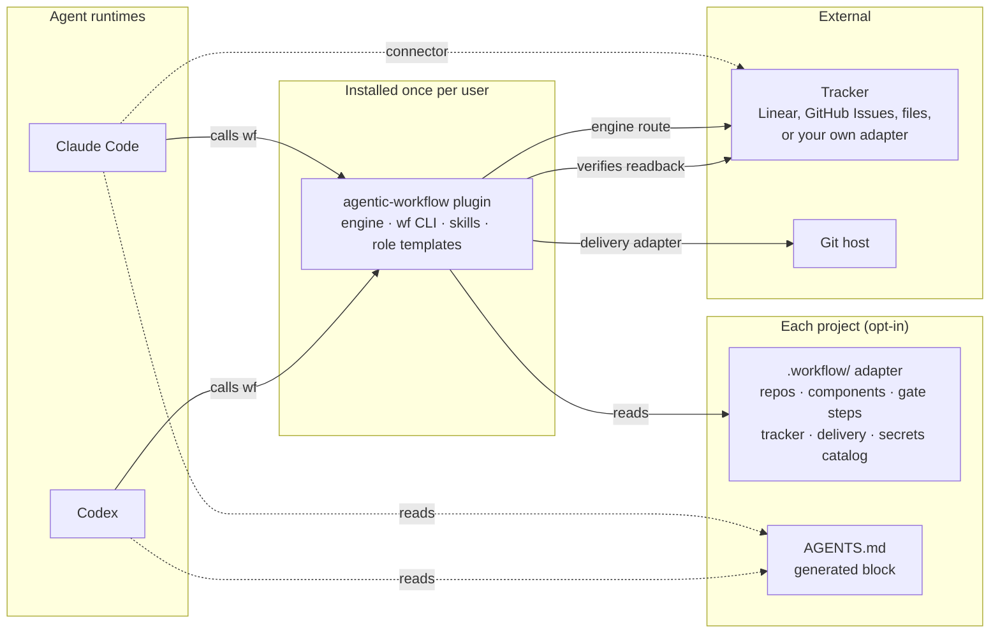

# Concepts: terms, parts and principles

[Back to the README](../README.md) · [Docs map](../README.md#docs)

## Terms

- **Project**: the whole onboarded system: one adapter (`.workflow/`), one tracker. It may hold several repos.
- **Repo**: one Git repository inside the project.
- **Component**: a logical part of the system (a service, a web app, a worker) mapped to a repo or a package in one.
- **Plugin**: agentic-workflow itself.

The word "workspace" is never used for any of these.

## How it fits together

- **Plugin:** the engine and the `wf` CLI. It knows no framework, tracker or company.
- **Adapter:** a committed `.workflow/` folder in each project. If it's missing or disabled, the plugin does nothing in that project.
- **AGENTS.md:** the only instruction file the workflow writes. Claude Code and Codex both read it.

## Principles

1. Authority to deliver comes from an admitted implementation intent with no hold. Nothing is inferred from prompts.
2. Every step checks evidence the engine wrote, never an agent's claim.
3. The reviewer never wrote or planned the change, and each review round is a fresh agent.
4. Criteria are frozen before code. Each one maps to evidence, not necessarily to a new test.
5. Gates are fast through reuse, not by skipping.
6. Interruptions keep finished work.
7. Delivery isn't a push: it ends with a verified tracker handoff.
8. Every refusal, limit or check names the failure it catches.
9. Agents never handle secrets.
10. The engine stays framework- and tracker-agnostic. Specifics live in adapters.
