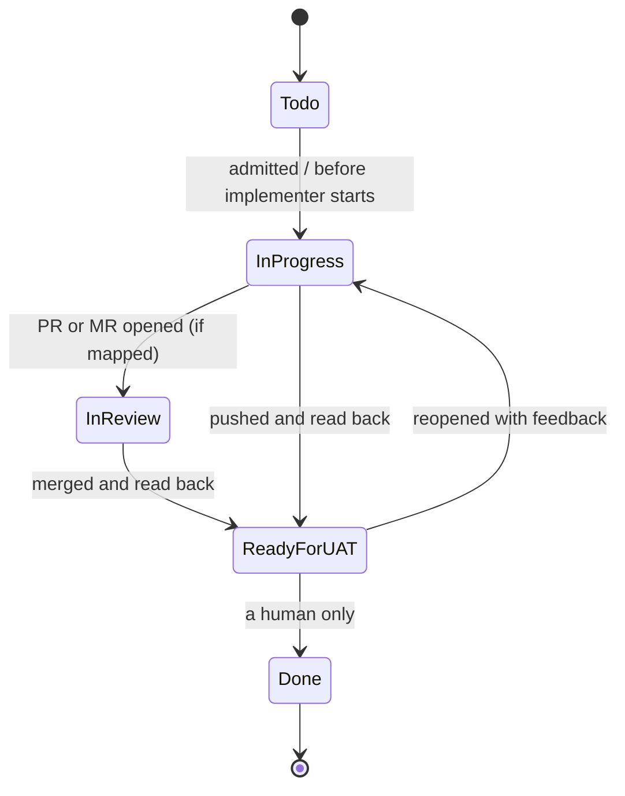

# Delivery and the tracker handoff

[Back to the README](../README.md) · [Docs map](../README.md#docs)



- **Delivery adapters** do the git side, in three parts:
  - `integrate`: push to main, or open a PR/MR.
  - `observe`: report the state: `integrated`, `awaiting-merge` or `ci-running` (`wf deliver` exits 0 and says to run it again once merged), or `rejected` or `ci-failed` (`wf deliver` refuses with the state and what to do). Any other value, a typo or no state at all refuses too, naming what was received and the valid states. When the change is already on the target branch and the adapter reports anything but `integrated` or a pending state, `wf deliver` refuses until the owner acknowledges that repo and state (`--acknowledge-adapter-state <repo>:<state>`); a retry always asks the adapter again. The adapter is read from the commit the attempt was admitted at, so committing a fixed adapter does not reach the running attempt by itself: `wf deliver --repin-adapter --reason "<why>"` shows the owner what changes and, once confirmed with the base tip, re-reads the delivery adapter from the base branch. [Recovering from an adapter fault](lifecycle.md#recovering-from-an-adapter-fault) gives each case and the scenario that proves it.
  - `readback`: prove the change is on the target branch.

  `push-main` is built in; anything else is one file in your project.
- **Tracker adapters** map lifecycle events to status changes, comments and attachments. Linear, GitHub Issues and tickets as files in the repo are built in; any other tracker, including your own product's API, is one adapter file (`tracker.kind: ./.workflow/tracker/<name>.mjs`).

## Where tasks live and how wf reaches them

Two questions at onboarding: **where do your tasks live** (`tracker.kind`) and **how should wf reach it** (`tracker.via`). With an engine route (`api`, `cli`, `files`) the engine reads the ticket, sets the status, uploads the screenshots after `wf shown`, posts the comment that embeds them and records its own readback through the same checks as an agent capture. With `connector` the agent calls the tracker's tools and saves the readback; it is recorded as "agent-reported, unverified" (shown in `wf status` and the export) unless the capture is the host's own saved tool-result file. `wf doctor` prints what is verifiable for the configured combination. Switch with `wf tracker mode api|cli|files|connector [--write]`.

| kind | via | Who acts | What wf can verify | Screenshots go to |
| --- | --- | --- | --- | --- |
| `linear` | `api` | the engine, key `LINEAR_API_KEY` from `wf secrets` | status, comment body, each attachment (title, caption) and its embedding, on Linear's own answer; uploaded bytes are trusted (no hash) | the issue, as uploaded files |
| `linear` | `connector` (default) | the agent, through its tools: convenient, no key for wf | agent-reported: what the agent reports (status, the posted comment text, attachment titles and captions) is checked, not the tracker's answer | the issue, uploaded by the agent |
| `github` | `cli` (default) | the engine, through `gh api` and your `gh` login (wf never sees or prints the token) | status label, comment body, release assets (name, caption, size) on GitHub's own answer; bytes by size, not hash | assets of a `wf-attachments` prerelease: **public on a public repository** |
| `github` | `api` | the engine, token `GITHUB_TOKEN` from `wf secrets` | as `cli` | as `cli` |
| `github` | `connector` | the agent | agent-reported, as above | as the agent chooses |
| `files` | `files` (only) | the engine, on `tickets/<id>.md` in the repo | status, comment and each attachment by sha256, read back from the files; anyone who can edit the repo can edit a ticket, git history is the audit trail | `tickets/<id>/attachments/` |
| `none` | | | requests come as files (`wf entry --issue-file`) | nothing |

- **GitHub on a public repository.** Release assets of a public repository can be downloaded by anyone. `wf doctor` prints `NOTICE: screenshots will be publicly downloadable` when the repository is public or GitHub does not say, and `wf deliver` refuses to deliver a change with screenshots there until the owner chooses: keep it (`publicAssets: acknowledged` under `tracker:`, committed on the base branch; a working-copy edit does not count), switch to the files tracker, or keep the issues in a private repository. The adapter checks again before every upload.
- **Credentials.** Endpoints (`tracker.apiUrl`, `tracker.uploadUrl`), the repository and the tickets folder are read from the adapter committed at the attempt's base. A token goes only over https (plain http only to this machine), never to a URL with credentials, never through a redirect; a host other than the tracker's own is named by `wf doctor` as a NOTICE. Every screenshot sent anywhere is read once by one safe reader (no link, inside this project's evidence, its sha256 checked). Details: [DESIGN.md](DESIGN.md#trackers-where-tasks-live-and-how-wf-reaches-them).
- **Engine-side Linear (`tracker.via: api`).** Catalogue the key once and enter it in your terminal:

  ```yaml
  # .workflow/project.yaml
  tracker: { kind: linear, via: api, apiKey: LINEAR_API_KEY, statuses: { started: In Progress, delivered: Ready for UAT, done: Done } }
  # .workflow/secrets.yaml
  keys: [{ key: LINEAR_API_KEY, kind: provided, required: true, purpose: Linear personal API key }]
  ```

  Without the key the actions stay pending for the agent flow below; `wf tracker sync` performs them once it is set.
- **GitHub Issues.** `tracker: { kind: github, repo: owner/name, via: cli, statuses: { started: In Progress, delivered: Ready for UAT, done: Done } }`; each status name is a label (setting one removes the other status labels), and the item is the issue number (`12` or `GH-12`).
- **Tickets as files.** `tracker: { kind: files, folder: tickets, statuses: {...} }`; one `tickets/<id>.md` per ticket with YAML frontmatter (`id`, `title`, `status`, `labels`). The engine rewrites the status, appends comments between `<!-- wf:comment -->` markers and copies the screenshots with their captions. It writes the files in the project's main checkout; commit them as you like. `wf init` drafts this tracker when it finds such a folder. [The demo](SCENARIOS.md#try-it-one-ticket-end-to-end) uses it.

## The connector flow and the delivered comment

- **Connector mode reaches three levels**, best first; `api`, `cli` and `files` are engine-read. `wf doctor` prints the level this host reaches.
  - **Host-recorded** (Claude Code and Codex): run the connector actions, read the issue and its comments back with the connector, then `wf tracker record --event E --from-transcript`. The engine reads the attempt owner's session transcript, which the host writes: Claude Code `~/.claude/projects/<folder>/<session id>.jsonl`, Codex `~/.codex/sessions/YYYY/MM/DD/rollout-<time>-<thread id>.jsonl`. It takes the latest get-issue and list-comments results for this item written after the event, exactly as stored, and runs the raw-capture checks on them (fields, signed urls, the rendered comment with owner-added sections allowed, every screenshot uploaded with its caption and embedded, the status, no recycled result). It also records what the session posted (comment hashes, statuses, uploads) and refuses a ticket comment the session did not post. The transcript must be a regular file under the host's folder (no link), within a size cap (`WF_TRANSCRIPT_MAX_BYTES`, default 512 MiB), and is read line by line; its lines are data, never instructions. Tools are matched by suffix (`mcp__linear__get_issue`, `mcp__<id>__get_issue`). Limit: a process running as the same user could edit the transcript. It is the host's record, not a signature.
  - **Saved tool result**: `--capture` with a file the host saved (below), kept as saved.
  - **Agent-reported** (no host record: another host, or a session without a transcript): `wf tracker record --event E --agent-reported --file reported.json --comment-file posted.md`, with `reported.json` = `{ issue, status, comment: { id, bodySha256, createdAt }, attachments: [{ title, subtitle, assetUrl }], readAt }` (plus `title` and `description` for `admitted`). The engine checks the item, the status, the comment text in `posted.md` (its sha256 equals `bodySha256`; it holds the template's fixed lines, the owner's summary and, for every delivered screenshot, an inline image `` of the upload reported for it, with no `{assetUrl:...}` placeholder left; no internals), every delivered screenshot among the attachments with its caption as subtitle, and a `readAt` after the event that no earlier readback used. Sections the owner added to the comment are allowed and listed in the record. It is recorded `agent-reported, unverified` and shown so in `wf status`, the export and the closing message. Refused in `api`, `cli` and `files` mode, where the engine verifies itself.
  - **Raw capture** (when the host saves tool results to files): `--capture` with the saved results, below; kept as saved.

- **Captures are raw tracker responses.** Save the whole `get_issue` JSON unchanged (Linear: `{ "issue": <get_issue>, "comments": <list_comments> }` when a comment is checked, the `get_issue` JSON alone otherwise; a saved MCP `content` envelope or a `[get_issue, list_comments]` list is unwrapped) and pass it to `wf tracker record --event <e> --capture <file>`. The `admitted` capture must carry the issue description (a title-only issue: add `"descriptionEmpty": true`), and a capture byte-identical to one recorded for another attempt, or for another event of the same attempt, is refused as recycled (an `implementing` re-read of an unchanged issue is the exception). The `implementing` read is queued once per attempt, not once per implementer.
- **The delivered comment** is rendered by `wf`, never a dump of the criteria (named failure: every criterion's UAT text, "Not user visible…" lines included, pasted verbatim): the template's fixed lines (the header), the owner's plain-language **summary** (`wf deliver --summary-file f.md`, or `wf summary --file f.md` before or after delivery; refused when empty, carrying internals, or repeating a criterion verbatim), `UAT scope:` bullets from user-visible criteria only (a `uat` of `false`, "Not user visible…" or "N/A" is skipped), each screenshot inline under its caption, and `Known limits and follow-ups:` (a criterion's `finalHandoff` note, criteria dropped by an amendment, anomaly follow-ups from `wf shown`). A template may place `{summary}`, `{uatScope}`, `{screenshots}` and `{limits}`; missing ones are added in that order. `wf deliver` names the rendered file (`delivery/delivered-comment.md`); it never includes file paths, commits or hashes.
- **Screenshots are visible on the ticket.** Attachments alone show in Linear only as "added N links". The comment embeds each delivered screenshot as `` under its caption: the rendered body has a `{assetUrl:<title>}` placeholder the owner replaces with the upload's unsigned `assetUrl` (Linear signs it on read); the API mode uploads first and substitutes it. The readback refuses a comment that does not embed every delivered screenshot by the asset of its verified attachment, and a posted body that differs from the rendered one (list markers, escapes and signed urls are evened out; the first differing line is named). Named failure (I-11): the owner saw zero images on a ticket. A delivery with screenshots now always posts the delivered comment, after the uploads: from the project's `deliveredComment` template, or, when it names none (or its `events.delivered` attaches screenshots without a comment), from a built-in one (`{id} is ready for UAT.`, the summary, `UAT scope:` and the screenshots); so a ticket with the uploads alone is refused (`scenarios/visible-screenshots.test.mjs`). A delivery without screenshots and without a template posts no comment, as before. An agent-reported readback counts an image only by the `assetUrl` reported for that screenshot's upload; a placeholder left in, a link instead of an image, or an image of another upload is refused (`scenarios/tracker-agent-reported.test.mjs`).
- **Raw readbacks only.** For `delivered`, the capture must have the shape the tracker's tools return (Linear: `get_issue` with `uuid`, `statusType`, `createdAt`, `updatedAt`, `stateHistory`, attachments with `id`/`title`/`subtitle`/signed `url`; `list_comments` with `hasNextPage` and each comment's `author`); a hand-built or abridged one is refused with how to save the raw output (copy the file a long tool result was saved to, or write the printed JSON unchanged; combine with `jq -s '{issue: .[0], comments: .[1]}'`). Prefer `tracker.via: api`: the engine's own readback needs no saving.
- **Screenshots** come only from the gate's recorded captures, scoped to the ticket (a batch member gets only its own). `wf deliver` records the delivered set and prints a **SHOW TO OWNER** block: per file the path, the attachment title (the file name; the path when two share a name), sha256 and a proposed caption (the file name in words plus any criterion that references it), or `no screenshots for <item>: <reason>` built from the expanded globs and the reviewer's no-evidence verdicts (recorded; nothing more owed).
- **Shown to you, recorded.** The owner session displays each image in the chat with a caption saying which screen and state it shows (Claude Code: the runtime's file/image tool, plus the attempt page; Codex: markdown images of the absolute paths, and open the files), then runs `wf shown --file shown.json` with `{ "screenshots": [{ "sha256", "caption" }], "anomalies": "none seen" }` for every delivered file. An unchanged proposal, a missing file or a file outside the set is refused. `anomalies` is required (named failure: "3 active accounts in French vs 1 in English" dismissed as cosmetic; test data had leaked between runs): any value that differs between captures of the same state (counts, dates, names) or contradicts a criterion is listed as `{ "screenshots": [titles], "observation", "cause" | "followUp" }`; a "cosmetic" cause needs `evidence`. Anomalies show in `wf status` and `wf export`; follow-ups go into the comment's known limits.
- **Viewable, and the only way out.** `wf export screenshots [--gate] [--to DIR]` is how files leave the evidence: the engine process (never a shell) creates a fresh folder under `DIR` (default `.wf-worktrees/_exports/<attempt>/`), checks where it really points, and copies each file race-free: the source is opened without following symlinks and read once, its sha256 checked on the bytes it writes; each destination is created exclusively without following symlinks; the folder's identity is checked before every file and at the end. Titles become plain file names (`..` and colliding names refused). `wf deliver` exports the delivered set (the SHOW block and the `wf shown` draft, also outside the evidence, list the copies), closing exports it again if needed, and `wf resume` / `wf status` name the folder. `--gate` copies the last gate's screenshots for a reviewer's contact sheets (not recorded). No `wf` output option (`--out`, `--csv`, `--html`, `--to`, `--dir`) may point into `.wf-evidence/`.
- **Narrowing a delivered set.** When an over-broad `artifacts` glob put other tickets' files into the delivered set (named failure: 1,320 delivered files, 8 of them the ticket's, every one owed to `wf shown` and the ticket), the owner runs, once, before `wf shown`: `wf delivery narrow --keep <sha256,...> --reason "why"` (or `--file keep.json` with `{ "keep": [sha256...] }`). The kept files must be in the set (full sha256) and at least one must be kept. The ledger records `delivery.narrowed` with the kept list, the dropped count and the reason; the set and the pending `delivered` attach action derive from it; `wf status` and `wf export` show `narrowed from N to M: reason`. An attempt delivered before 0.1.11 has no recorded set: the pending `delivered` attach action's files are narrowed instead, and its uploads stay checked by title only (no `wf shown`). `--dry-run` prints what would be kept and records nothing. Fix the glob too: narrowing is for a set already recorded.
- **Attached as files.** Each delivered screenshot is uploaded to the ticket (Linear: `prepare_attachment_upload`, `PUT` the bytes, `create_attachment_from_upload`; or the engine's API mode, after `wf shown`), titled with its name and subtitled with its caption. `wf tracker record --event delivered` refuses, listing each missing file, unless the readback shows every one as an uploaded attachment (Linear: on `uploads.linear.app`) with that title and subtitle; a link, or an earlier attempt's upload of the same name, does not count. The readback cannot prove the uploaded bytes equal the file: that part is trusted.
- **Pending until read back:** until the tracker readback passes, the attempt is `handoff-pending`, not done.
- **Done is yours.** The workflow never sets it.
