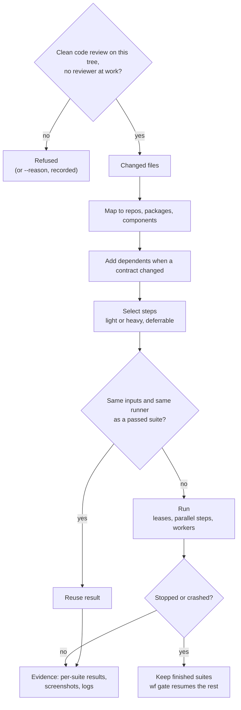

# The gate and the evidence

[Back to the README](../README.md) · [Docs map](../README.md#docs)



- **When it runs:** once per reviewed tree, after a code-review round on it came back clean, and never beside a review round. `wf gate` refuses while the latest round has open or unverified findings, no round covers the current tree, or a reviewer handed this tree has recorded no closure; `wf gate --reason "<why>"` runs it anyway and records a `gate.override` ledger event. While it runs, `wf handoff reviewer` is refused; the handoff after it passes is the evidence review, whose bundle carries the logs and screenshots. See [the order of work](lifecycle.md#roles-and-handoffs).
- **Stopping:** `wf stop --class major-finding|tree-change|owner-decision --reason "<why>"`. The `gate.stopped` event records the class, the reason, the minutes of interrupted step work (`discardedMinutes`), the wall-clock minutes the run had spent (`wallMinutes`) and how many steps had finished. A gate stopped by the owner's decision resumes with `wf gate` (finished steps carried); one stopped for a finding or a tree change is followed by the fix and a code-review round, then the gate.
- **Steps are your commands,** in any language: `yarn jest`, `vendor/bin/phpunit`, `pytest`, `go test`, `gradle test`, `xcodebuild test`.
- **Per-suite results come from JUnit XML.** A plugin is only needed for what JUnit can't carry, such as screenshots or container teardown.
- **Reuse:** a suite reruns only when its inputs or its runner change. Worker counts never invalidate a pass.
- **Parallelism:** `maxParallelSteps` sets how many steps run at once. Leases (`docker`, `browser`, `simulator`) stop resource-heavy steps from colliding.
- **Workers:** `auto` sizes them from measured free memory and performance cores, never below the minimum you set.
- **Live output:** `wf gate` prints a line as each step starts and finishes (status, seconds; for a failure the first failing suite or the last 5 log lines, secrets masked), so a gate run in the background shows progress in its log. With `--json` these lines go to stderr. A failing step never stops the others. While a gate runs, `wf status` and `wf resume` show the steps running and finished.
- **Base movement:** when the base branch advances, the gate reopens only if the new commits touch the ticket's paths or shared infrastructure.

## Gate step fields

Each entry under `gate.steps` in `.workflow/project.yaml` (full example in [adapter.md](adapter.md)):

| Field | Meaning |
| --- | --- |
| `id`, `repo` or `component`, `package` | Which step, and where it runs. |
| `run` or `plugin` | The shell command, or a step plugin committed in `.workflow/`. |
| `inputs`, `ignores` | Globs the step depends on and provably does not depend on. No `inputs`: the step runs every gate. |
| `alsoInputs` | **Required for any step that builds, starts or reads a sibling repo** (an end-to-end step that runs the API from `../api`, a contract test reading `$WF_ROOT/web`). Their trees join the reuse key, so a change there reruns the step; an unreadable tree means it always runs. Without it, a passing step is reused after the sibling changed: one portal end-to-end pass was reused against old API code. `wf doctor` warns when a step's command references another repo's path without listing it. |
| `tier` | `light` or `heavy`. `--focused` runs light steps only. |
| `when.paths` | Run only when a changed file matches. |
| `report.junit`, `select` | Per-suite results and suite-level reruns. |
| `workers`, `shards`, `lease`, `deferrable` | Sizing, resource leases, batch deferral. |
| `artifacts` | Globs of screenshots and files the step writes that count as this ticket's evidence. Placeholders `{item}` (the tracker id as given, `ENG-12`), `{itemLower}` (`eng-12`) and `{attempt}` (`ENG-12.1`) are expanded per attempt (for a batch, once per member too); any other `{name}` is refused. See [Per-ticket evidence](#per-ticket-evidence). |

`sharedInfra` (per package) lists files whose change reruns every step of the package. Keep it to real infrastructure (lockfiles, root build config): a broad glob such as `scripts/**` makes every edit to a data file under it rerun everything.

## Per-ticket evidence

Every screenshot a step's `artifacts` globs match on a gate run is evidence the reviewer must inspect (`wf accept` refuses until each sha256 is in `screenshotsInspected`). A glob without a placeholder (`e2e/.results/**/*.png`) matches everything the whole suite wrote: a real ticket was refused with 1,300 screenshots from other tickets' specs, none of them its own. The convention:

- The project's UI tests write a ticket's evidence under a ticket folder (for example `e2e/.evidence/eng-12/…`, from the spec that covers that ticket), and the adapter points `artifacts` there: `e2e/.evidence/{itemLower}/**/*.png`. `wf init` drafts exactly that for Playwright (under its `testDir`) and Cypress (under `cypress/`), and no artifacts for other runners.
- Every step gets `WF_ITEM` (the attempt's item as given, `ENG-12`) and `WF_ITEMS` (space-separated items of the run: the attempt, and for a batch every member). They decide WHICH captures the tests make (for example, a spec writes its screenshots only when its ticket is in `WF_ITEMS`). WHERE they are written stays the project's convention, the spec's own ticket folder: a helper must not default every capture's folder from `WF_ITEM`, or every old spec's captures land in the current ticket's folder and become owed evidence again.
- A step whose package the ticket did not change owes nothing when its globs match nothing. A step whose globs matched nothing although the ticket changed files in its package is marked `uncovered` in the bundle (with `changedHere`): the reviewer gives a verdict, `noEvidence: [{ "step": "e2e", "reason": "why no capture is needed" }]` in the closure, or a finding that names the step. `wf accept` refuses an uncovered step without one; the verdicts are ledgered with the acceptance and shown by `wf export`. Named failure: a UI-changing ticket whose tests wrote no capture passed as "no screenshots for this ticket" and nothing flagged it.
- Every file that is matched must still be inspected. The reviewer bundle's `gate.artifacts` lists, per step and glob (as declared and as expanded), the matched files with their sha256; nothing outside the expanded globs is ever required. A criterion mapped to `kind: screenshot` must name one of those files (its sha256 or source path); `wf accept` refuses any other ref.
- The adapter is read at the attempt's base, so fix the globs on the base branch before the next ticket, not mid-attempt.
- `wf doctor` warns, from the adapter alone, on every glob without a placeholder; prints each glob's matched count from the most recent gate; and warns when such a glob matched files there and that ticket changed nothing under the glob's directory.

## Light checks, flakes and repair reruns

- **`wf check [--repo r]`** runs the adapter's light steps for the attempt's repos (only the named repos need to be committed). It is the implementer's definition of done: the bundle lists the exact steps and the command. Its results use the gate's keys, so the full gate reuses them, but a check never counts as a gate for acceptance or delivery.
- **Scheduling:** the gate starts light steps first, then heavy steps longest first (by their last recorded duration), so wall time is not the heavy steps run in adapter order and light failures show early.
- **Flakes:** a step that failed and then passed with the same key (same inputs and runner) is recorded as `gate.flaky`, with the suites that flipped; `wf status` and the reviewer bundle show it.
- **Suite-level reruns:** declare `report: { junit: <path> }` and `select: "<how the runner takes files>"` (for example `select: "--runTestsByPath {suites}"` for Jest, `select: "{suites}"` for a runner that takes paths) and put `{select}` in `run`. A failing step then reruns only its failed or changed suites; passing suites are carried.
- **`wf gate --rerun-failed`** runs only the steps that failed last time (reusing what still passes). Like `--focused`, it is proof while repairing and never counts.

## Scope

When the frozen plan names paths (`anchors`, `tests.changed`, `tests.run`), every changed file none of them names is outside the plan. Named failures: an implementer changed audit-read code outside the plan and the reviewer marked it minor; a capture fix and an e2e build change with `.gitignore` entries were covered by no criterion until the owner amended the criteria after the review.

- **The owner is told before the review.** `wf status`, `wf resume`, `wf check` and `wf gate` (before the run starts) print `N changed file(s) outside the plan: <every file> — amend the criteria (wf criteria amend) or fix it, before the review`, and `wf handoff reviewer` repeats it on stderr (never in the reviewer's one-line prompt). It is a warning, never a refusal. For an intended change, amend the criteria before handing to the reviewer.
- **The reviewer gives each file a verdict.** The bundle lists them under `outsidePlan`; the closure carries `outsidePlan: [{ "file": "app:src/audit.ts", "verdict": "covered", "by": "C2", "evidence": "C2 logs the audit read" }]`. `covered` needs `by` to be a criterion id (amended criteria included); anything no criterion covers is `"verdict": "finding"` with the finding id in `by`. `wf accept` refuses, listing each file, until every listed file has a valid verdict with evidence. Verdicts are recorded on the acceptance and shown in `wf export`.
- **Not scope:** a package's `docsOnly` files, files a step `ignores` (generated output), and the plugin's own `.wf-evidence/` and `.wf-worktrees/` paths. A plan that names no paths requires nothing.

## Leases for agents' own stacks

`wf run --lease docker -- docker compose up --wait` runs a command holding the same machine-wide slot a gate step with `lease: docker` takes, waiting while every slot is held, and frees it when the command exits. Implementers start docker stacks and browsers this way so concurrent attempts never exceed `gate.leases`.

## Step environment

Steps, provisioning (`install`, `onWorktreeCreate`), `wf doctor` checks and secret `verify` commands get an allowlisted environment, not the owner's whole one: the toolchain variables in `engine/env.mjs` (`PATH`, `HOME`, `USER`, `SHELL`, `LANG`/`LC_*`, `TERM`, `TMPDIR`, `TZ`, `CI`, `NODE_OPTIONS`, `XDG_*`, `SSH_AUTH_SOCK`, `DOCKER_*`, `COMPOSE_*`, `npm_config_*`, `NVM_*`, `JAVA_HOME`, `VIRTUAL_ENV`, `PYENV_*`, `GOPATH`, `CARGO_HOME`, `RUSTUP_HOME`, proxies and CA bundles, and more), every `WF_*` variable, and the catalogued secrets a step lists in `usedBy`. Add project variables with names or `*` prefixes:

```yaml
gate:
  env:
    pass: [PLAYWRIGHT_BASE_URL, MYAPP_*]
```

The engine sets `WF_ROOT`, `WF_ATTEMPT`, `WF_ITEM`, `WF_ITEMS`, `WF_STEP`, `WF_EVIDENCE` (a scratch folder outside the evidence, copied in after the step), `WF_WORKERS` (and `WF_SHARD`/`WF_SHARDS` per shard) for every step; see [Per-ticket evidence](#per-ticket-evidence) for `WF_ITEM(S)`.

Agent-runtime variables (`CLAUDE_CODE_*`, `ANTHROPIC_*`, `CODEX_*`, `OPENAI_*`, `GROK_*`, `XAI_*`) never reach a step unless `pass` names that family itself (`ANTHROPIC_BASE_URL`, `ANTHROPIC_*`); a broad prefix such as `C*` does not count. Step plugins get the filtered environment as `ctx.env`, but they run inside the `wf` process.

## Review rules

Project documents a reviewer must read when the change touches what they govern: a design system, coding rules, an error-code catalogue. Named failure: in eleven review rounds no reviewer read any of them.

```yaml
# web project: rule files with Claude-style `paths:` frontmatter, plus a skill for UI changes
review:
  rules:
    - { id: design-system, read: [.claude/rules/design-system.md] }   # paths: from the file's frontmatter
    - { id: i18n, paths: ["src/**/*.tsx", "messages/**"], read: [docs/i18n.md] }
requires:
  skills: [{ name: ui-review, roles: [reviewer], when: { paths: ["src/**/*.tsx", "src/**/*.css"] } }]
```

```yaml
# CLI or library: public API and compatibility rules
review:
  rules:
    - { id: public-api, paths: ["src/**", "include/**"], read: [docs/api-stability.md, CHANGELOG.md] }
    - { id: cli-output, repo: cli, paths: ["cmd/**"], read: [docs/cli-conventions.md] }
```

- Each rule is `{ id, repo?, paths?, read: [docs] }`. Without `paths`, the first document's `paths:` frontmatter is used; without either, it applies to every change (`wf doctor` warns, and warns on a document not committed on the base, which is then skipped).
- The reviewer bundle lists the matching rules under `rules` (with the changed files each matched, the documents as committed at base, and `docChangedByTicket` when the ticket edited one) and the round's skills under `skills`. Both come from the adapter at the attempt's base, so a ticket cannot drop its own rules, and every reviewer gets the same list: it adds to the review and never narrows it.
- The reviewer reads every document and skill and gives each rule a verdict in the closure: `rules: [{ "rule": "design-system", "verdict": "complies|finding|not-applicable", "evidence": "src/app/page.tsx:40, tokens section", "finding": "F2" }]`. `wf accept` refuses a missing verdict, empty evidence, or a `finding` verdict without a finding id of that closure. The verdicts show in `wf export`.
- Where Claude Code transcripts exist, `wf review` refuses a round whose transcript shows no successful `Read` of each listed document (a Bash `cat`/`sed`/`grep` of a worktree copy also counts; the evidence copy can only be read with Read), or no `Skill` call (or read of `SKILL.md`) for each listed skill, and names what was not read. Elsewhere the round is recorded `unverified`.
- A skill's `when` is `visual` (screenshots were collected), `{ paths: [globs] }` (a changed file matches, so a review before the gate needs it too), or omitted (always).

## Design system checks

The shared components and the bans a reviewer must not miss, as machine-checkable rules. Named failure: a UI ticket shipped a hand-rolled `<table>` instead of the shared table component, and data tables without the shared pagination, after a blind review whose prompt only implied "follow the design system".

```yaml
designSystem:
  components:
    - { name: DataTable, path: src/components/DataTable.tsx, use: every data table }
    - { name: Pagination, path: src/components/Pagination.tsx, use: every paged list }
  rules:
    - { id: no-raw-table, description: "no raw <table>/<thead> outside the shared table", forbidPattern: "<(table|thead)\\b", paths: ["src/**/*.tsx"], except: ["src/components/DataTable.tsx"], read: docs/design-system.md }
    - { id: table-has-pagination, description: "a shared table is used with the shared pagination", pattern: "<DataTable\\b", requireWith: ["<Pagination\\b"], paths: ["src/**/*.tsx"] }
```

- A rule is `{ id, description, forbidPattern | pattern + requireWith, paths?, except?, repo?, read? }` (regexes, globs). It runs over the lines the attempt **added** (the committed diff against its base), with the adapter at base: a `forbidPattern` hit is an added line that matches it; a `pattern` hit is the first added line matching `pattern` in a file whose committed text lacks a `requireWith` pattern. Existing code is not the ticket's.
- `wf gate` and `wf check` warn with the hits. The reviewer bundle lists them under `designSystem.hits` (with the components); the reviewer gives each a verdict, `designHits: [{ "id", "verdict": "justified|finding", "evidence", "finding" }]`, and `wf review` refuses a closure missing one (`wf accept` checks again and records the verdicts).
- The planner and implementer bundles carry the components and rules; the planner turns a changed UI surface into a criterion "uses the shared components: <list>". The reviewer lists, for every changed UI file, each table, list, form and dialog it renders and the shared component used or the justified exception.

## Evidence integrity

The evidence (`.wf-evidence/attempts/<attempt>/`) is protected in three layers. Only the third is relied on; the first two keep mistakes from happening, the third catches what gets through.

| Layer | What it does | What it catches |
| --- | --- | --- |
| 1. Guard hook (convenience) | `hooks/guard-evidence.mjs` refuses Edit/Write/MultiEdit/NotebookEdit on evidence paths and any Bash command that names the evidence, except one plain `wf` invocation (details below). | An agent in Claude Code reaching for the evidence by habit, before anything is written. |
| 2. Write protection (accident-proofing) | Every recorded file is `0444` and, on macOS, user-immutable (`chflags uchg`); on Linux `chattr +i` when running as root with `CAP_LINUX_IMMUTABLE` (a default container drops it, and non-root cannot), else silently skipped. Folders are `0555` between commands. Only the engine lifts it, for its own writes. Root ignores modes. `wf doctor` probes and lists which layers are on. | A careless write from any tool or process (MCP tools, Codex, a script, a person) running as a normal user: it fails with a permission error. |
| 3. Manifest, verified at use (detection) | Every file the engine writes into an attempt's evidence is recorded in the hash-chained ledger (`evidence.recorded`: path, sha256, size, mode, hashed from the one read of its bytes, never through a link). Every `wf` command that opens an attempt checks the chain, the chain-head anchor, and every recorded file: present, a regular file, recorded size and mode, no file the engine did not write, no unreadable folder. Content commands (`gate`, `check`, `handoff`, `review`, `accept`, `deliver`, `tracker`, `shown`, `summary`, `delivery`, `export`, `verify`) re-hash every file; `accept` and `deliver` also re-check, right before they record or push, that nothing verified at open has changed since. Other commands re-hash only a file whose stat signature (size, mtime, ctime, inode, mode) differs from the one recorded after its last hash. | Any change that got past 1 and 2, made by anything: a refusal listing every problem at the next use. `wf verify [--attempt ID \| --all]` lists them. |

- **Gate steps** get `WF_EVIDENCE` (and `{evidence}`) pointing at a scratch folder outside the evidence (`.wf-worktrees/_gate/<attempt>/<run>/<step>/`); the engine copies it in after the step, and collects `artifacts` from the worktree by reading each file once (the recorded sha256 is of the bytes copied). The gate's own record of each artifact's sha256 is checked against the manifest, so a capture changed between collection and recording is refused too.
- **The anchor**: every ledger append also writes the chain head (`{ seq, hash }`) to `.wf-worktrees/_anchor/<attempt>.json`. A ledger that is truncated, restored from an older copy or rewritten without it is refused. It proves only that the ledger and the anchor agree: a process that rewrites the ledger, recomputes the chain *and* rewrites the anchor is not detected (it is not a signature, and there is no key).
- **Attempts from before 0.1.20** are adopted on first use, as found: their existing files are recorded once (a baseline, not proof of what came before).
- **Gate runs** are open only when the ledger records them started (`gate.started`) and not finished; a folder alone opens nothing. Each finished step is appended (`gate.step`); a dead runner's run is recovered from those entries, never from its progress file. A step's scratch files land under its `out/` folder (they can never take the name of the engine's log or artifacts); links in the scratch folder or the worktree are not copied or collected; reuse happens only after the earlier runs are re-hashed.
- **Links are never followed, hard links never shared.** Every engine write into the evidence, its anchor and caches opens with `O_NOFOLLOW`; an existing file is never written in place: the new content goes into a fresh exclusive file in the same folder, renamed over it (a hard link's shared data is not touched); appends (the ledger, step logs) refuse a file with more than one name. Every mode change is `lstat`, open with `O_NOFOLLOW`, `fstat` compared with the `lstat` (device, inode, one name), then `fchmod` on the descriptor. Hard links are refused at record, protect, unprotect, verify, rebaseline and copy-in (a step cannot hard-link an outside file into the evidence). Paths are judged by one function (`engine/paths.mjs`, used by the engine, the CLI's option checks, export, release and the guard hook): resolved component by component as the OS does (a link followed before a following `..`), names compared separator-bounded (`.wf-evidence-x` is not `.wf-evidence`), case and Unicode forms folded on a case-insensitive volume, trailing slashes and `.` ignored. A link planted at any evidence entry is refused by name; its target is left byte-identical, mode and flags unchanged (tested on macOS with `uchg` and on Linux with `chattr +i`).
- **What stays path-based** (Node has no `openat`/`fchflags`): `chflags`/`chattr` (each entry is `lstat`ed before and after; a swap in between has the flag change undone on whatever was swapped in, and the call refuses), `rename`, `unlink`, `mkdir`, `readdir`, and the check that each folder below `.wf-evidence` is a real folder before a file is opened in it. A folder swapped for a link in that window is not prevented; the next verification refuses it.
- **Repair.** A file changed outside wf (a tool, a disk problem, a person fixing something) does not brick the attempt: `wf verify --accept-changes --attempt ID` lists each difference (changed, added, removed; old and new sha256), and only with `--reason "<why>"` appends `evidence.rebaselined` with the reason and every path and hash. `wf status`, `wf export` and the reviewer's bundle then show it. A missing file is accepted only as removed; a link or a non-regular file must be replaced first; the ledger itself (chain, anchor) is never re-baselined.
- **Release.** `wf evidence release [--attempt ID | --closed | --older-than DAYS] [--reason "why"] [--dry-run]` deletes closed or abandoned attempts' evidence: one rename out of `attempts/` (so a failed delete never leaves a half-listed attempt), the protection lifted by the engine, then the delete; a tombstone anchor refuses a ledger reappearing under that id. Nothing else deletes evidence (closing removes worktrees and scratch folders only); never `rm -rf` it by hand.
- **Measured** (`node bench/evidence.mjs`, Apple M4 Max, macOS, immutable flag on; one attempt with 6,346 evidence files, 1.45 GB: 1,320 screenshots of 0.2-1.2 MB, 20 logs of 5-50 MB, 5,000 small files): `wf status` 0.46-0.49 s, `wf resume` 0.57 s, `wf verify` 1.08 s, `wf handoff reviewer` 1.48 s, `wf review` 1.23 s, `wf accept` 1.38 s, `wf deliver` 8.65 s (of which most is exporting the 1,320 screenshots for viewing), the gate that wrote and recorded the fixture 6.04 s.
- **Linux** (checked in a `node:22-bookworm` container on OrbStack): as non-root the modes apply and `chattr +i` is off (needs root); as root the modes stop nothing and `chattr +i` fails with "Operation not permitted" unless the container has `CAP_LINUX_IMMUTABLE` (then it works on overlayfs and tmpfs). Every case degrades silently and `wf doctor` says which layers are on; detection works in all of them. The suite passes there as root and as non-root.

**Accepted limits, plainly.** This makes careless writes fail and every other change visible at the next use; it does not stop a determined process running as the same user:
- such a process can lift the protection, rewrite files, the ledger, recompute the chain and rewrite the anchor consistently; nothing local can prove otherwise;
- while a `wf` command runs, the attempt's folders are writable for it: a file planted *during* that command in the folder of the gate run it is recording, or a recorded file changed before the command records it, is recorded as the engine's (the gate's own artifact hashes still catch a changed capture);
- reading is not controlled: Read, Grep and Glob are allowed (reviewers need them), so the **blind-review** property cannot be proven from file access. It rests on the provenance checks (the transcript shows the handed agent type and exactly the printed start line, a fresh id each round) and on the reviewer reading only what its bundle names;
- the engine's own reads of an input file (`--file`, `--capture` ...) are checked, then read: a file swapped between the two is read as swapped.

### The guard hook (layer 1)

The hook (matcher `Edit|Write|MultiEdit|NotebookEdit|Bash`) is registered globally and ordinarily decides on raw text. It does not parse general shell:

- **Bash:** a command that mentions the evidence in any form is refused (case-insensitive; also after removing quotes, backslashes, `$'`, `${`, braces and whitespace; Unicode folded with NFKC and invisible characters dropped; escapes decoded; a glob such as `.wf-*` that can match it; an expansion next to part of the name), and so is any command run inside it. The one exception: the whole trimmed command is exactly one `wf <subcommand> [args]` with none of `; & | \` $ ( ) < >`, newline, backslash or quote characters, and not `wf run` (it executes the command after `--`, so it is judged like any other command; named failure, 0.4.5: `wf run --lease X -- <command>` on the evidence passed as a plain `wf` invocation). Prose is not exempt: a commit message, echo text or grep pattern that names the folder is refused too; write "the evidence folder" instead.
- **The refusal says what matched and how to avoid it** (I-16): it names the token that matched (or the working directory, for a command run inside the evidence) and lists the ways around it: "the evidence folder" in prose, the Read tool or `wf evidence list` / `wf evidence show <path>` to read, `wf export screenshots` for images, one plain `wf` invocation per command. What is refused is the same as before, plus `wf run`. A tokenizer that exempts quoted text was tried and not released: two bypasses were found in review.
- **`wf evidence list [--kind K] [--attempt ID]`** lists the attempt's evidence files by kind (ledger, plan, handoff, review, gate log, gate record, tracker, delivery, issue, screenshot, other) with their paths relative to the attempt folder and their full paths. **`wf evidence show <path>`** prints a text file given by that relative path. Both write nothing of their own (opening the attempt runs the usual evidence verification, as every `wf` command does). A link at the attempt folder is refused. Files are listed by kind; an entry that is not a regular file is listed as such and never read. `show` refuses an absolute path, `..`, a path outside this attempt's evidence, a link, a file with more than one name, a binary file and an image (it points to `wf export screenshots`). It reads and prints at most 4 MiB and says when it cut the file. Nothing in either command needs the folder's name.
- **File tools:** a target that mentions the evidence, is relative inside it, or really lies in it (symlinks resolved) is refused, whatever else the input carries. The content written is not inspected (a closure may cite evidence paths).
- **Fails closed** on unreadable input, an unknown shape or an exception when the input mentions the evidence. It is never more permissive than the 0.1.15 hook (a 1,000+ case corpus test).
- **Unrelated literal searches:** outside project, evidence and worktree scope, one literal `rg`/`grep` invocation with a quoted regex, allowlisted no-argument flags, and explicit existing regular-file operands can use a regex such as `.*`. Only the regex span is ignored by the broad-glob predicate; every direct, escaped or assembled evidence-name check still inspects the original command. Canonical operands and cwd are checked, including symlink aliases. Directory/implicit-cwd searches, shell chains, redirections, expansions, wrappers, unknown flags, missing operands and ambiguous scope retain the conservative decision. The global hook still runs: host registration is not a project workflow, and actual evidence remains protected across projects. This limited read-only exception preserves the frozen write-protection baseline; it is not a blanket outside-project bypass.
- **`wf` itself** checks its own paths, once: every path option (`--out`, `--csv`, `--handoffs-csv`, `--html`, `--dir`, `--to`, `--root`; `--file`, `--capture`, `--summary-file`, `--closure`, `--issue-file`, `--from`) is resolved by `engine/paths.mjs` as the OS will resolve it, validated, and replaced by that resolved path, which is what is then opened or written; each input file is read once (the bytes checked are the bytes kept). Refused: anything in the evidence (written or read), an empty value or a missing one, a URL (`file://`), a `~` the shell did not expand, a trailing slash on a file input, a folder where a file belongs (and the reverse), and a path option given twice. Attempt ids and skill names must be plain names. Cleanup at close deletes nothing through a link and leaves anything uncertain in place.
- It sees only the tools its matcher names in Claude Code; everything else is covered by layers 2 and 3.
- **Known false positives** (refused although nothing names the evidence folder): any command containing `wf-ev` in any spelling (a file called `notes-wf-evidence.md`), `evidence` glued to `*`, `?` or `$` (`grep -E '*evidence'`), a dot-glob that can match the folder (`ls .*`), and `$` or backticks together with `wf-` or `.wf`. Allowed since 0.3.0: a grep pattern with `|` or a bracket, a path through `.workflow/`, the plugin's own folder name, and `evidence` in prose next to a comma or alongside a `$`.
