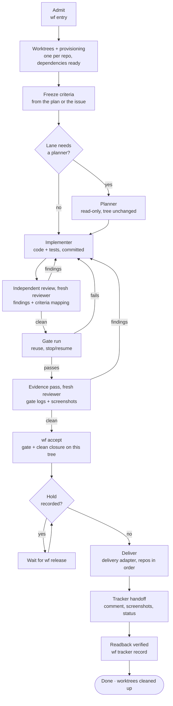
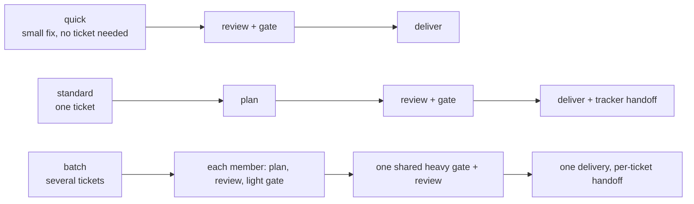

# The lifecycle, lanes, roles and work classes

[Back to the README](../README.md) · [Docs map](../README.md#docs)

## The lifecycle



| Step | Command | What the engine checks |
| --- | --- | --- |
| Admit | `wf entry` | Intent is `implementation` or `analysis`. Analysis can never deliver. |
| Worktrees | automatic | One worktree per repo; dependencies cloned or installed; ignored files like `.env.local` copied in. |
| Criteria | `wf plan --from-agent <planner id>` | Criteria and every plan section are frozen before implementation, taken from the planner's transcript unchanged; unknown top-level keys are refused. Later changes go through `wf criteria amend --reason`. |
| Plan | `wf handoff planner` | The planner leaves the tree unchanged. |
| Implement | `wf handoff implementer` | Changes are committed before review and the gate. |
| Review | `wf handoff reviewer`, `wf review` | Allowed once the work is committed, before or during the gate. The reviewer isn't the owner, planner, an implementer or a reviewer of an earlier round. Where transcripts exist, its transcript must show the agent type handed and exactly the printed start line. The closure is bound to the tree it was handed; earlier rounds' open findings are revealed only after it, for verification. |
| Gate | `wf gate` | Each step's evidence is hashed. A newer failure beats an older pass. |
| Accept | `wf accept` | On the current tree: a passing full gate, a closure with every finding fixed or shown to be a non-issue, written after that gate passed (an evidence pass when the review came first). Every criterion maps to evidence or a justified n/a. |
| Deliver | `wf deliver [--summary-file F]` | Implementation intent, no hold, review accepted; the owner's summary recorded when a delivered comment is posted. |
| Shown | `wf shown` | Every delivered screenshot shown to the owner with a caption the owner wrote, and the anomalies seen (or "none seen"); nothing owed when none were delivered. |
| Handoff | `wf tracker record` | From the raw tracker output: the status, the comment `wf` rendered (with every screenshot inline) and every delivered screenshot as an uploaded file with its caption. |

A stopped or interrupted attempt resumes with `wf resume`, which says exactly what's next. With more than one open attempt, every command it prints carries `--attempt <id>`.

### The plan file

`wf plan --from-agent <planner id>` reads the planner's last ```` ```yaml ```` block from its Claude Code subagent transcript (found by the name it was started with), so the owner never retypes it. `wf plan --file <file>` takes the same YAML from a file. The plan sections (`summary`, `contract`, `anchors`, `tests`, `doNotRun`, `externalServices`, `agentSplit`) may sit under `plan:` or at the top level beside `criteria` and `work`; `plan:` may also be plain text (the summary). Any other top-level key is refused with the list of known ones, because a section the engine does not read never reaches the implementers. Every section is stored in the frozen plan and handed to the implementers and reviewers in their bundles.

### Durable artifacts and the attempt page

Everything an agent or the owner produced is kept verbatim, write-once and hash-bound in `.wf-evidence/attempts/<id>/` at the moment the engine consumes it: the raw plan (`plans/plan-1.raw.yaml`, or `.json`), every amendment file (`plans/amend-<n>.raw.*`), every closure as written (`review/closure-<round>.raw.json`), the handoff bundles, gate results and tracker captures. Nothing exists only in chat.

`wf export [--attempt id] [--out file]` writes one self-contained HTML page (no external requests, light and dark, phone width) for the attempt at any phase: item and phase, every plan section, work items with class and agents, criteria with each amendment and its reason, handoffs, review rounds with findings, gate and check runs per step, the last gate's evidence per artifacts glob (expanded, with matched files, or none for this ticket), flakes, tracker events, delivery, and the delivered screenshots embedded as images (only the delivered set, each checked against its sha256, with the owner's caption or the proposal marked as such; click to enlarge). `--json` prints the same data. Catalogued secrets are masked. The page is a view; the ledger and evidence are the source of truth. `wf resume` prints the path of the latest export and warns when the frozen plan has no `contract` or `anchors`.

### Base movement

`wf status` and `wf resume` fetch each repo's base (a failed fetch is noted, never an error) and say `base moved: N commits` and whether it overlaps the files the ticket changed. `wf base merge` merges the base into each worktree: it refuses a dirty tree or a running gate, aborts a conflicting merge so the worktree is left as it was, records a ledger event, and notes when the merged commits touch the ticket's files. A merge that moves HEAD leaves the gate and the review without a pass for the new tree (both are bound to it): run `wf gate` and a fresh reviewer. Delivery still merges a moved base itself and reopens the gate only when it overlaps.

## Lanes



- **quick:** for small fixes. Same gate and independent review, but no planner and no tracker.
- **standard:** one ticket, the full lifecycle.
- **batch:** tickets share their heavy gate. Each ticket defers its heavy steps, the batch runs them once, then everything is delivered together and each ticket gets its own handoff.
- **focused:** a gate option, not a lane. When every changed file is in the adapter's `focused` paths, `wf gate --focused` runs only the light steps: fast proof while repairing. It never counts as the proof of a tree: `wf accept` and `wf deliver` refuse a focused gate, a reviewer handed a focused-gated tree is told no gate passed on it, and name the heavy steps it skipped.

## Roles and handoffs

```mermaid
sequenceDiagram
  participant O as Owner (your session)
  participant WF as wf engine
  participant PL as Planner
  participant IM as Implementer
  participant RV as Reviewer
  O->>WF: wf entry (implementation)
  WF-->>O: attempt, worktrees, tracker: In Progress
  O->>WF: wf handoff planner
  WF->>PL: bundle (issue, criteria, topology)
  PL-->>WF: plan + frozen criteria (tree unchanged)
  O->>WF: wf handoff implementer
  WF->>IM: bundle (plan, criteria, affected components)
  IM-->>WF: commits
  O->>WF: wf handoff reviewer (gate may run in parallel)
  WF->>RV: bundle (diff, criteria; no gate evidence yet)
  RV-->>WF: findings + criteria → evidence mapping
  O->>IM: fix findings (same implementer), commit
  O->>WF: wf gate
  WF-->>O: evidence (suites, screenshots, logs)
  O->>WF: wf handoff reviewer (new agent: evidence pass)
  WF->>RV: bundle (diff, criteria, gate evidence)
  RV-->>WF: closure, screenshots inspected
  O->>WF: wf accept, then wf deliver
  WF-->>O: delivered, tracker actions pending
```

- Roles are agents your runtime starts: subagents in Claude Code, tasks in Codex.
- `wf sync` writes each project's role files from the plugin's templates plus the project's own additions. Effort and model come from [work classes](#work-classes): one implementer agent per class, and the planner and reviewer at their role's class.
- **Planner** returns the plan as a short checklist: summary, the cross-repo contract (routes, DTO fields, error codes, permission subjects), anchors (file:line of each function to change), tests to write and the targeted selectors to run, suites not to run, the external-services policy (default runs need no provider keys or internet) and the agent split (what can proceed in parallel once the contract is committed).
- **Implementers** can run in parallel, one per work item (or per repo or area), after the contract is committed (`wf handoff implementer` accepts several; `--work W1` hands over one work item and prints the agent type to start). They run only the specs they changed while iterating, then the repo's lint and full unit suite once before finishing; the gate runs the rest.
- **Reviewer** is started blind and fresh: `wf handoff reviewer` prints one line (the bundle path), and that line is its whole prompt, with no hints, summaries, focus areas or earlier findings. Every round is a new agent with a new id; the engine refuses an id that reviewed an earlier round of the attempt, because a resumed reviewer is anchored on what it found before. Each round reviews the whole attempt against the frozen criteria. The bundle holds the criteria, amendments with reasons, the plan, the diff's worktrees and bases, and says whether a gate passed on this tree (with its logs and screenshots when one did). It is never the planner or an implementer.
- **Review order:** review comes before the gate, because each finding found after a full gate costs another full gate. Hand the committed change to a reviewer, fix its findings, gate the fixed tree, then a fresh reviewer does the evidence pass (gate logs and screenshots) and `wf accept`. The owner may start the review and the gate together (never editing the worktrees while the gate runs). Review first when findings are likely (money, authorization, migrations); both together when findings are rare, so a clean review and a passing gate leave only the evidence pass.
- **Role appendices:** `roles.<role>.appendix` in the adapter names a file under `.workflow/` whose text `wf sync` appends to that role's generated agent under "Project additions". Role agents generated while a session runs register only after it restarts; start the agent type `wf handoff` names, never a general-purpose agent, and never pass a model on the spawn (both override the agent file's effort and model).
- **Amending criteria:** `wf criteria amend --file f --reason "why"` merges by criterion id. Criteria in the file replace the frozen ones with the same id, a new id is added, and every id the file does not mention stays as it was. Removing one takes an explicit `{ id: C3, dropped: true, reason: "..." }` entry. The command prints the full list after the change and what changed, added or dropped. Adding by listing a new id is safe because nothing is lost: a mistyped id adds a criterion the reviewer must map rather than removing one.
- A separate tester role is available but off by default. Frozen criteria plus review of the gate's evidence cover the same failure with one fewer handoff.

## Work classes

A work class says how hard an agent thinks on a kind of work. The planner groups the criteria into work items and gives each one a class; `wf handoff implementer --work W1` then names the agent generated for that class (`wf-implementer` for the implementer role's class, `wf-implementer-<class>` for every other), whose file sets the effort and, if configured, the model.

| Class | Default `use` text | Claude effort | Codex effort |
| --- | --- | --- | --- |
| `full` | Money, payments, audit, authorization, data isolation between customers, migrations, external protocols, and anything the project's invariants file calls a critical boundary. | high | inherited |
| `light` | UI wired to a frozen contract, translations, generated docs or OpenAPI output, test fixtures. | low | inherited |

- Any work item that touches something `full` covers is `full`. The planner and the reviewer run at `full` unless the project changes their role's class; the implementer role's own class (default `full`) is used when a handoff names no work item.
- Model is unset by default, so the agent inherits the session's model. **Pin it** with `classes.<name>.claude.model` (and `codex.model`) when you compare classes or efforts: one effort comparison was confounded because the owner's session switched model and every unpinned agent followed. `wf doctor` warns when no class pins a model and an attempt shows more than one observed model; `wf report` shows the session model recorded at each handoff.
- The default effort values are starting points, not measurements. `wf report` shows the declared effort next to the effort observed in each agent's transcript; a difference is shown, never enforced.
- **Classes change effort only.** The gate, the blind independent review, frozen criteria, evidence integrity and the hash-chained ledger are identical for every class. A light work item gets the same gate and the same full-class reviewer as a full one.
- An implementer whose work turns out to touch something a stronger class covers stops and tells the owner.
- The list is open: add classes or override the defaults in the adapter (entries merge with the defaults by name). Claude effort is one of `low`, `medium`, `high`, `xhigh`, `max`; Codex effort is one of `minimal`, `low`, `medium`, `high`, `xhigh`. Those are the values each runtime documents today, checked so a typo fails at load; a new runtime value needs a plugin update. An unknown class anywhere (a role, a work item) is refused with the list of known classes.

A web SaaS with a backend and a web app, adding a class for copy changes:

```yaml
classes:
  full:
    use: Money handling; access control and data isolation; database migrations; public API contracts.
  light:
    use: Screens wired to an already-merged API contract, translation files, generated API docs, test fixtures and seed data.
  copy:
    use: Marketing pages and in-app wording with no logic change.
    claude: { effort: low }
    codex: { effort: minimal }
roles:
  planner: { class: full }
  reviewer: { class: full }
  implementer: { class: full }
```

A small single-repo library, where most work is ordinary and only the public API needs the strongest agent:

```yaml
classes:
  full:
    use: The public API surface, serialization formats, and anything semver depends on.
    claude: { effort: xhigh }
  standard:
    use: Internal changes behind an unchanged public API.
    claude: { effort: medium }
  light:
    use: Docs, examples and test fixtures.
roles:
  implementer: { class: standard }
```
