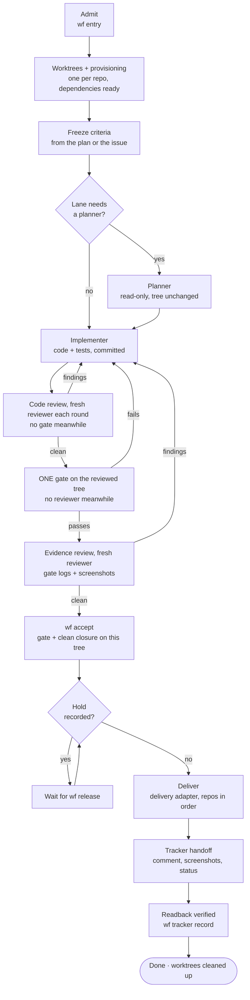
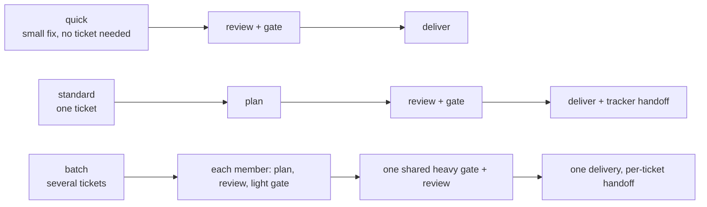

# The lifecycle, lanes, roles and work classes

[Back to the README](../README.md) · [Docs map](../README.md#docs)

## The lifecycle



| Step | Command | What the engine checks |
| --- | --- | --- |
| Admit | `wf entry` | Intent is `implementation` or `analysis`. Analysis can never deliver. |
| Worktrees | automatic | One worktree per repo; dependencies cloned or installed; ignored files like `.env.local` copied in. |
| Criteria | `wf plan --from-agent <planner id>` | Criteria and every plan section are frozen before implementation, taken from the planner's transcript unchanged; unknown top-level keys are refused. For cross-cutting work the plan carries the two-stage [impact analysis](#impact-analysis), whose queries the engine re-runs. Later changes go through `wf criteria amend --reason`; one that adds scope owes an impact update before the next implementer. |
| Plan | `wf handoff planner` | The planner leaves the tree unchanged. |
| Implement | `wf handoff implementer` | Changes are committed before review and the gate. No implementer starts while an amendment owes its impact update. A fix handoff (review findings open) names a [pattern sweep](#fix-rounds-sweep-the-pattern) per finding, and the next review waits for the implementer's answers. |
| Review | `wf handoff reviewer`, `wf review` | Allowed once the work is committed, never while a gate runs on the attempt. The reviewer isn't the owner, planner, an implementer or a reviewer of an earlier round. Where transcripts exist, its transcript must show the agent type handed and exactly the printed start line. The closure is bound to the tree it was handed (a round refused because the tree changed leaves a `review.refused` ledger event); earlier rounds' open findings are revealed only after it, for verification. |
| Gate | `wf gate` | Only after a clean code review on this tree: refused while the latest round has open or unverified findings, no round covers the current tree, or a reviewer is at work (`--reason` overrides, recorded as `gate.override`). Each step's evidence is hashed. A newer failure beats an older pass. |
| Discovered issues | `wf discovered add\|list\|close` | Every issue found during the ticket is recorded and ends fixed by a commit of this ticket or deferred in the owner's words; the reviewer gives each a verdict. |
| Accept | `wf accept` | On the current tree: a passing full gate, a closure with every finding fixed or shown to be a non-issue, written after that gate passed (the evidence review). Every criterion maps to evidence or a justified n/a. |
| Deliver | `wf deliver [--summary-file F]` | Implementation intent, no hold, review accepted, no discovered issue open; the owner's summary recorded when a delivered comment is posted. |
| Shown | `wf shown` | Every delivered screenshot shown to the owner with a caption the owner wrote, and the anomalies seen (or "none seen"); nothing owed when none were delivered. |
| Handoff | `wf tracker record` | From the raw tracker output: the status, the comment `wf` rendered (with every screenshot inline) and every delivered screenshot as an uploaded file with its caption. |

A stopped or interrupted attempt resumes with `wf resume`, which says exactly what's next. With more than one open attempt, every command it prints carries `--attempt <id>`.

### The plan file

`wf plan --from-agent <planner id>` reads the planner's last ```` ```yaml ```` block from its Claude Code subagent transcript (found by the name it was started with), so the owner never retypes it. `wf plan --file <file>` takes the same YAML from a file. The plan sections (`summary`, `contract`, `anchors`, `tests`, `doNotRun`, `externalServices`, `agentSplit`) may sit under `plan:` or at the top level beside `criteria` and `work`; `plan:` may also be plain text (the summary). Any other top-level key is refused with the list of known ones, because a section the engine does not read never reaches the implementers. Every section is stored in the frozen plan and handed to the implementers and reviewers in their bundles.

### Impact analysis

Named failure (I-26): a cross-cutting ticket was planned in a few minutes from a count of where one shared component appeared. The planner never characterised how each consumer behaved (data source and limit, write paths, empty, error, phone layout, sorting, totals) and never opened the other repo; its bundle's `impact` was empty because the engine derives impact from a diff, and none exists before planning. Most of the work added later, and most review findings, were one search away on the base commits.

The planner writes two stages in its plan, in this order, and `wf plan` checks both:

1. **`survey`, before the design**: what exists around the issue. `queries` (below), then `components` (one row per affected component: `file`, the `query` that found it, and every column: `endpoint`, `limit`, `writePaths`, `paging`, `empty`, `loading`, `error`, `permission`, `mobile`, `rtl`, `publicApi`, `sorting`, `reorder`, `clientTotals`, `rawEnums`, `tests`; `none` or `n/a` is an answer, a missing column is refused), `consumers` (`symbol`), `flows` (`flow` and its `failure` path) and `patterns` (defects that may recur). Every entry has an `id`, its `query` and that query's `hits`; a component row's `file` must be a hit of its query.
2. **The design**: `plan`, `criteria`, `work`.
3. **`impact`, after the design**, derived from it: `changes`, one per changed symbol, endpoint, DTO, error code and migration, each with `element`, `kind`, `cites` (a criterion id, a work item id, or text from an anchor or the contract: an entry that cites nothing in the design is refused), `covers` (survey ids), `consumers: { query, hits }`, `flows` (each with `failure`), `contracts` crossed and `suites` that must run (each with `query` and `hits`), and `work` when the plan has work items. Every survey entry is covered by a change or listed under `excluded` with a `reason`. A suite a change says must run may not appear in `doNotRun`. `impact.queries` holds queries the design adds (callers of a new symbol, tests asserting an old schema).

**Queries are data, run by the engine.** `{ id, pattern, kind: literal | regex, repo?, paths?: [globs], exclude?: [globs], unit?: files | lines, ignoreCase?, hits }`. The engine lists the committed tree (the attempt's worktree HEAD for a repo in the attempt, else that repo's base branch), reads each blob itself, matches the pattern per line in its own process (a JavaScript regular expression for `regex`), and counts files (or lines). No shell runs; a pattern is never a command. Files over `impact.maxFileBytes` (2 MiB) are skipped and listed; a query that reads more than `impact.maxScanBytes` (512 MiB) is refused. `wf plan` re-runs every query and refuses a recorded `hits` that differs from what it finds, so a count cannot be invented. `wf impact run --attempt <id>` runs the recorded queries on the current tree, `--file <plan>` a plan file's, and `--query '<json>'` one query (for a read-only planner checking a count).

**When it is required.** For a lane that has a planner, when any work item (or, without work items, the implementer role) runs at a class the adapter lists under `impact.requiredFor` (default `[full]`). A plan with a design and no survey, or no impact map, is then refused. A plan that is not required to carry the stages may still carry them; they are then checked the same way. The quick lane has no planner and needs none.

**Amendments.** An amendment that adds or changes criteria, replaces the work items or adds a repo owes an impact update when the attempt carries an impact map (or its classes require one). Put `impact` in the amendment file: new `queries` and `survey` entries for the added scope, `changes` citing the new criteria or work items, `excluded`; or `impact: { unchanged: "<why the amendment adds no element>" }`. It is checked like the plan (new query ids, counts re-run, every new survey entry covered or excluded). An amendment file may carry only `impact`. Until it is recorded, `wf handoff implementer` and `wf accept` refuse.

**The reviewer re-derives it.** The reviewer bundle carries `impactMap`: the survey, the impact map, every addendum, the recorded queries and counts, the `inventory` of survey and impact ids and `sampleSize` (10, or all when fewer), and `derived`: symbols the final diff declares or edits (declarations on changed lines and the enclosing function git names in each hunk) and, for each, the files that use it outside every file the map lists (`outside`; the adapter folder is left out). The closure needs `impactChecked`: `queries` (each recorded query with the count `wf impact run` shows on the reviewed tree; `wf review` re-runs them and refuses a mismatch), `sampled` (at least `sampleSize` distinct inventory entries, each `matches` or `finding` with evidence) and `derived` (each outside caller `in-map` with evidence, or `impact-gap` naming a finding with `"category": "impact-gap"`). `wf report` counts `impactGaps` per attempt: findings outside the map, a direct measure of the plan.

### Fix rounds sweep the pattern

Named failure (I-25): fix briefs targeted single findings, so the same defect pattern recurred over many review rounds (an empty later page losing its pager, a failed Next stranding the user, raw enum codes on screen). An implementer handoff while review findings are open is a fix handoff: `wf handoff implementer --sweep <file>` with `sweeps: [{ finding: "<reviewer>:<id>", why, query: { pattern, kind, repo, paths, exclude } }]`, one per open finding the handoff covers (all of them, or those tagged with its `--work`). Without it the handoff is refused. The engine runs each query (ids `S1`, `S2`, ...), prints the hits and puts them in the bundle's `sweep`. The implementer fixes every real instance and answers each sweep in a commit trailer, `Sweep <id>: fixed - <what>` or `Sweep <id>: clean - <why no other hit is an instance>`; `wf handoff reviewer` refuses while one is unanswered. The next reviewer bundle lists `sweeps` with the query, the hits at the handoff and now, and the answer. A second implementer handoff in the same fix round owes no new sweep for a finding already swept.

**Restrictions the diff has outgrown.** Named failure: a plan's `doNotRun` banned one repo's suites ("no source changes there"); the ticket later changed that repo, the ban stayed, and a stale public-API test reached review that the banned suite would have caught. `wf handoff` and `wf criteria amend` warn (on stderr, never in a reviewer's prompt) when a `doNotRun` entry or `externalServices` names a repo the attempt's diff now touches, or a gate step of such a repo.

### Every issue found is fixed in the ticket

Named failure (I-18): implementers, reviewers and the owner agent noted real defects found during a ticket (a pager total that summed one page, tables with no phone view, an implicit page-size default, a failed step that stranded the user) and parked them as follow-ups or "harmless today" without the owner deciding. Named failure (I-19): a frozen "no change in repo X" criterion blocked a fix that needed an additive change in that repo, and the only way through was an amendment framed as an exception.

- **The discovered-issue ledger.** Any role records an issue it finds, inside or outside the criteria: `wf discovered add --summary "<what is wrong>" [--where <file:line>] [--found-by <agent id>]` (ids `D1`, `D2`, ...). `wf discovered list` shows them; `wf status` and `wf resume` count the open ones, and the next step is to fix them.
- **Two ways to close one.** `wf discovered close D1 --fixed <commit> [--repo R]`: the commit must be on the attempt's branch in that repo, after its base (the base, another branch or an unknown sha is refused). A deferral comes from one of two owner channels, never from an agent's free text (`--decision` is refused; `--by` is attribution only). Named failure (0.4.4): a deferral was refused only when the caller-typed `--by` named a role agent, so an agent that left `--by` out deferred with invented words.
  - **The owner's message, host-recorded:** the owner starts a message in the owner session with the phrase `wf discovered list` prints, `defer <attempt id>:<issue id>` (for example `defer ENG-1.1:D3`), optionally followed by `: <reason>`. Then `wf discovered close D3 --deferred`. When the entry is added, the engine anchors the owner session's transcript (`claude:<session>` or `codex:<thread>`, the file `wf tracker record --from-transcript` reads): its size and the sha256 of its bytes. The deferral is taken only when exactly one genuine owner turn after that offset, with those bytes unchanged, starts with the phrase (case and spacing folded; the issue id may not continue, so `D10` is not `D1`). The whole turn is recorded verbatim, with the phrase, the transcript file, line, byte offset and anchor (`provenance: host-recorded`). No natural-language intent is judged: "D3 can't wait" or "Don't defer D3" do not start with the phrase and are refused. The attempt id in the phrase keeps two attempts (batch members) with the same issue id apart. Refused: `--decision` and `--quote` (never accepted), no matching turn, two or more matching turns, no anchor (the owner had no readable transcript when the entry was added; `wf discovered add` says so at once), a changed prefix, and another transcript file. An owner message holding an image or any other non-text block never counts as a deferral, even when its text starts with the phrase (it fails safe: write the phrase in a plain text message). These never count: tool results; meta lines; compaction summaries; lines the host marks as not from the person (`origin.kind` or `turnOrigin` other than `human`: task notifications, messages relayed from other agents, scheduled prompts); turns that are a host or runtime wrapper (`<scheduled-task>`, which this host records with origin human, `<task-notification>`, `<system-reminder>`, relayed and cross-session messages, hook and command output, Slack wake-ups, Codex environment, AGENTS.md, subagent-notification, heartbeat and shell-command blocks); assistant text; and subagent transcripts. Anything else written into the transcript as a plain user turn counts.
  - **The owner's terminal:** `wf discovered defer D1 --reason "<why>"` runs only when stdin and stdout are an interactive terminal and asks for `D1` to be typed (recorded `provenance: interactive-terminal (unverified)`). No guard rule tries to stop a wrapper around it: a deny-list of pseudo-terminal, interpreter and encoding tools cannot be complete (see the [trust model](trust-model.md)).
  - **Acknowledged at delivery.** No channel proves a person, so a deferral counts only after the owner has seen it. `wf deliver` refuses while any deferral (a batch member's too) is unacknowledged. It lists each one with its id, summary, the owner's recorded words, the channel and its verification level. `wf deliver --acknowledge-deferrals D2,D3` (batch members' as `<attempt>:D2`) delivers. The acknowledgement is recorded after the pre-push checks (gate, acceptance, evidence unchanged); a refusal before that records no acknowledgement. After it, an id already acknowledged is accepted again, so the same command is run again after a push conflict, after an adapter that is still waiting for merge (that is not a refusal: `wf deliver` exits 0 and says it is waiting) and after a failed adapter readback. In that last case, when the accepted commit is already on the target branch, the retry records the delivery as recovered from the remote and does not call the adapter's readback again: the engine's own git check (the accepted, gated commit is an ancestor of the target branch) is the proof it relies on, so an adapter whose readback proves more than branch ancestry is not re-checked on a recovered retry. An id that is not awaiting acknowledgement is refused. The delivery output lists every deferral, every batch member's included, and the delivered comment's known limits print each with its attempt-qualified id, the owner's words, the channel and whether it was acknowledged.
  - **What each guarantees, and what not.** Host-recorded: the owner session's transcript, as written at the time the entry was added and after, holds an owner turn naming the entry and deferring it. It is the host's record, not a signature: a process running as the same user can append to or edit the transcript (after the anchor, undetected; before it, refused). Interactive-terminal (unverified): the command ran at an interactive terminal and the id was typed there. A process that allocates a pseudo-terminal (`script`, `expect`) can answer it, so it proves a terminal, not a person. The plain Bash tool of Claude Code or Codex has no terminal and is refused. Both channels make a deferral a deliberate act that leaves a record. Neither proves who acted. That is why `wf deliver` prints every deferral verbatim with its source, the owner acknowledges each one there, and the reviewer bundle carries the same text.
- **The role that found it fixes it.** An implementer that finds an issue while working fixes it in this attempt, in whatever file it lives in; its work-item brief is never a reason to leave it, and the owner sends such a report back to that implementer instead of fixing or relaying it. The one exception is a file another work item is editing at that moment: the implementer records it with `wf discovered add ... --blocked-by <work item>` and names the D id in its report, and the owner routes it to that work item's implementer (the next step says so). A reviewer never fixes: its findings go to the implementer of the work item they are tagged with.
- **Unfixed issues in a report are refused** (named failure: an implementer reported "Not fixed, outside the brief: the status field shows the raw enum value" and handed it to the owner to relay). `wf handoff reviewer` reads each implementer's final report from its Claude Code transcript (by the name it was started under, after its handoff) and refuses while a line leaves an issue unfixed ("not fixed", "outside the brief", "out of scope", "follow-up", "deferred", "left as is", "harmless") without naming a discovered entry (D<n>); a negated line ("no follow-ups") passes. Without a transcript (another runtime) nothing is checked; the role texts still apply.
- **Delivery refuses an open entry** (for a batch, any member's). Deferred entries go to the delivered comment's known limits with the owner's words, and to the attempt page.
- **The reviewer judges each.** The implementer and reviewer bundles list every entry under `discovered`. The closure gives each a verdict: `discovered: [{ id, verdict: fixed|deferred|open, evidence }]` (`deferred` only for an entry the owner deferred). `wf review` refuses a closure missing one; `wf accept` refuses an `open` verdict and an entry recorded after the round was handed (a fresh reviewer judges it).
- **A fence that blocks a fix is a criteria defect.** The planner states invariants ("the contract seam stays matched; existing fields, permissions and tenant isolation are unchanged"), never a blanket "no change in X". When a criterion, a work item's repos or the admitted repos block a fix, the owner amends the criteria; the fence is never the reason to defer or to ship a cosmetic workaround. A fix that needs another repo adds it in the same step: `wf criteria amend --file f --reason "why" --add-repo api` creates the repo's worktree on the attempt's branch from its current base, provisioned as at admission, and records the amendment. When the attempt has work items, the amendment must include one for the added repo. The gate and delivery then cover that repo like any other, and the reviewer bundle lists it under `addedRepos`: the closure judges the contract seam on both sides, `seams: [{ repo, verdict: matched|finding, evidence, finding }]` (`matched` cites the producer's file:line and the consumer's), and is refused without it.

### Recovering from an adapter fault

An attempt is pinned to the adapter (`.workflow/`, the delivery adapter included) as committed at its admission. When the delivery adapter reports a state that is not documented, `wf deliver` refuses with the state it received. Committing a fixed adapter on the base branch helps only new attempts; the running attempt keeps refusing (proven: `scenarios/delivery.test.mjs`, "a broken delivery adapter"). The owner decides the recovery.

The steps below apply only when `wf abandon` accepts the attempt. `wf abandon` refuses once any repo is recorded as delivered or skipped, including an unchanged repo that delivery records as skipped. Its refusal does not say which case applies, so check the delivery record first: `wf status --attempt <id> --json` shows it under `delivery.repos`; the steps apply only when that is empty.

**Single repo, standard lane, `delivery.repos` empty** (proven by two scenarios, with and without a `wf base merge` before the fault):
1. Commit and push the fixed adapter on the base branch.
2. `wf abandon --reason "<why>" --attempt <id>`. The attempt's branch `wf/<id>` is kept and holds the changes.
3. `wf entry --item <item>` starts a new attempt from the current base, with the fixed adapter.
4. In the new worktree: `git merge --squash wf/<old id>`, then `git commit`. A squash merge brings in exactly the ticket's change, also when the old attempt merged an advanced base. A `git cherry-pick <base>..wf/<old id>` range fails after a `wf base merge`, because of the merge commit.
5. Plan, hand off, gate, review, accept and deliver the new attempt as usual.

Not covered by those scenarios:
- **Any repo recorded as delivered or skipped** (not tested): `wf abandon` refuses, and the pinned adapter cannot change for this attempt. There is no supported recovery in this release (inbox entry I-21).
- **Several repos, `delivery.repos` empty** (not tested).
- **Quick lane** (not tested): the new attempt is admitted with `wf entry` (a new `QF-<n>`) or with `wf entry --item <id> --lane quick`; whether a planner is involved depends on the project's `roles.planner.lanes`.
- **Batch**: there is no tested recovery (inbox entry I-22).

### Durable artifacts and the attempt page

Everything an agent or the owner produced is kept verbatim, write-once and hash-bound in `.wf-evidence/attempts/<id>/` at the moment the engine consumes it: the raw plan (`plans/plan-1.raw.yaml`, or `.json`), every amendment file (`plans/amend-<n>.raw.*`), every closure as written (`review/closure-<round>.raw.json`), the handoff bundles, gate results and tracker captures. Nothing exists only in chat.

`wf export [--attempt id] [--out file]` writes one self-contained HTML page (no external requests, light and dark, phone width) for the attempt at any phase: item and phase, every plan section, work items with class and agents, criteria with each amendment and its reason, handoffs, review rounds with findings, gate and check runs per step, the last gate's evidence per artifacts glob (expanded, with matched files, or none for this ticket), flakes, tracker events, delivery, and the delivered screenshots embedded as images (only the delivered set, each checked against its sha256, with the owner's caption or the proposal marked as such; click to enlarge). `--json` prints the same data. Catalogued secrets are masked. The page is a view; the ledger and evidence are the source of truth. `wf resume` prints the path of the latest export and warns when the frozen plan has no `contract` or `anchors`.

### Base movement

`wf status` and `wf resume` fetch each repo's base (a failed fetch is noted, never an error) and say `base moved: N commits` and whether it overlaps the files the ticket changed. `wf base merge` merges the base into each worktree: it refuses a dirty tree or a running gate, aborts a conflicting merge so the worktree is left as it was, records a ledger event, and notes when the merged commits touch the ticket's files. A merge that moves HEAD leaves the gate and the review without a pass for the new tree (both are bound to it): run `wf gate` and a fresh reviewer. Delivery still merges a moved base itself and reopens the gate only when it overlaps.

## Lanes



- **quick:** for small fixes. Same gate and independent review, but no planner and no tracker.
- **standard:** one ticket, the full lifecycle.
- **batch:** tickets share their heavy gate. Each ticket defers its heavy steps, the batch runs them once, then everything is delivered together and each ticket gets its own handoff.
- **focused:** a gate option, not a lane. When every changed file is in the adapter's `focused` paths, `wf gate --focused` runs only the light steps: fast proof while repairing. It never counts as the proof of a tree: `wf accept` and `wf deliver` refuse a focused gate, a reviewer handed a focused-gated tree is told no gate passed on it, and name the heavy steps it skipped.

## Roles and handoffs

```mermaid
sequenceDiagram
  participant O as Owner (your session)
  participant WF as wf engine
  participant PL as Planner
  participant IM as Implementer
  participant RV as Reviewer
  O->>WF: wf entry (implementation)
  WF-->>O: attempt, worktrees, tracker: In Progress
  O->>WF: wf handoff planner
  WF->>PL: bundle (issue, criteria, topology)
  PL-->>WF: plan + frozen criteria (tree unchanged)
  O->>WF: wf handoff implementer
  WF->>IM: bundle (plan, criteria, affected components)
  IM-->>WF: commits
  loop code review until a round comes back clean (no gate)
    O->>WF: wf handoff reviewer (new agent: code review)
    WF->>RV: bundle (diff, criteria; round: code-review)
    RV-->>WF: findings + criteria → evidence mapping
    O->>IM: fix findings (same implementer), commit
  end
  O->>WF: wf gate (one, on the reviewed tree; no reviewer meanwhile)
  WF-->>O: evidence (suites, screenshots, logs)
  O->>WF: wf handoff reviewer (new agent: evidence review)
  WF->>RV: bundle (diff, criteria, gate evidence)
  RV-->>WF: closure, screenshots inspected
  O->>WF: wf accept, then wf deliver
  WF-->>O: delivered, tracker actions pending
```

- Roles are agents your runtime starts: subagents in Claude Code, tasks in Codex.
- `wf sync` writes each project's role files from the plugin's templates plus the project's own additions. Effort and model come from [work classes](#work-classes): one implementer agent per class, and the planner and reviewer at their role's class.
- **Planner** returns the plan as a short checklist: summary, the cross-repo contract (routes, DTO fields, error codes, permission subjects), anchors (file:line of each function to change), tests to write and the targeted selectors to run, suites not to run, the external-services policy (default runs need no provider keys or internet) and the agent split (what can proceed in parallel once the contract is committed).
- **Implementers** can run in parallel, one per work item (or per repo or area), after the contract is committed (`wf handoff implementer` accepts several; `--work W1` hands over one work item and prints the agent type to start). They run only the specs they changed while iterating, then the repo's lint and full unit suite once before finishing; the gate runs the rest.
- **Reviewer** is started blind and fresh: `wf handoff reviewer` prints one line on stdout (the bundle path), and that line is its whole prompt, with no hints, summaries, focus areas or earlier findings. On stderr, for the owner only, it prints the agent type and the name to start it under (`Start agent type wf-reviewer (name it <id>; ...)`), as every other handoff does. `wf review` identifies the round's agent by that name in its transcript. An agent started without a name is accepted when exactly one unnamed transcript of the handed type began with this handoff's line after it (recorded `identity: unnamed`); none, several, or another type is refused with how to start it. Every round is a new agent with a new id; the engine refuses an id that reviewed an earlier round of the attempt, because a resumed reviewer is anchored on what it found before. Each round reviews the whole attempt against the frozen criteria. The bundle holds the criteria, amendments with reasons, the plan, the diff's worktrees and bases, and says whether a gate passed on this tree (with its logs and screenshots when one did). It is never the planner or an implementer.
- **Order of work:** code-review rounds run to clean first, with no gate; then ONE gate on the tree that passed review; then the evidence review (gate logs and screenshots) of the gated tree, and `wf accept`. Review and gate never run side by side. Why: any finding made after a gate starts makes that gate obsolete (on one ticket that ran them side by side, 15 of 16 gates were stopped and about 175 of 271 gate minutes discarded), and a gate on an unreviewed tree proves nothing about review. The engine holds the order:
  - `wf gate` refuses while the latest review round has open findings or has not verified earlier rounds' open findings, while no review round covers the current tree (the same tree, or the same change of the ticket after a base merged in without touching it), and while a reviewer handed this tree has recorded no closure. `wf gate --reason "<why>"` runs it anyway and records a `gate.override` event (reason, the refusals it overrode, the tree). `wf gate --prepare-only` and `wf check` are never refused.
  - `wf handoff reviewer` refuses while a gate runs on the attempt (or is starting). The handoff records its round holding the gate lock, so a gate starting at that moment is refused too. A code-review round never needs a gate: its bundle says `round: code-review` and carries no gate evidence. The handoff after a gate passed on the tree is the evidence review (`round: evidence-review`): its bundle carries the gate's logs, screenshots and artifacts.
  - `wf stop` needs `--class major-finding|tree-change|owner-decision` and `--reason`; the `gate.stopped` event records the class, the reason, the minutes of interrupted step work (`discardedMinutes`; finished steps are kept for reuse), the wall-clock minutes the run had spent (`wallMinutes`) and how many steps had finished. `wf resume` continues a gate stopped by the owner's decision; one stopped for a finding or a tree change goes back to the implementer and a code-review round first.
  - A review round whose closure is refused because the worktree changed during it (an implementer still editing) leaves a `review.refused` event and is over: the next round is a fresh reviewer on the committed tree.
  - `wf resume` names the step for each state: the code review (no gate yet), waiting for the reviewer at work, fixing open findings then the next code-review round, the one gate after a clean round, waiting for the running gate, the evidence review, then `wf accept`.
- **Role appendices:** `roles.<role>.appendix` in the adapter names a file under `.workflow/` whose text `wf sync` appends to that role's generated agent under "Project additions". Role agents generated or changed while a session runs reach it only after it restarts: `wf sync` lists every role file whose content changed (it rewrites only those), and `wf handoff` warns when the agent type's role file changed after the owning Claude Code session started (the later of its transcript's first entry and its process start); start the agent type `wf handoff` names, never a general-purpose agent, and never pass a model on the spawn (both override the agent file's effort and model).
- **Amending criteria:** `wf criteria amend --file f --reason "why" [--add-repo R]` merges by criterion id (`--add-repo`: see [Every issue found is fixed in the ticket](#every-issue-found-is-fixed-in-the-ticket)). Criteria in the file replace the frozen ones with the same id, a new id is added, and every id the file does not mention stays as it was. Removing one takes an explicit `{ id: C3, dropped: true, reason: "..." }` entry. The command prints the full list after the change and what changed, added or dropped. Adding by listing a new id is safe because nothing is lost: a mistyped id adds a criterion the reviewer must map rather than removing one.
- A separate tester role is available but off by default. Frozen criteria plus review of the gate's evidence cover the same failure with one fewer handoff.

## Work classes

A work class says how hard an agent thinks on a kind of work. The planner groups the criteria into work items and gives each one a class; `wf handoff implementer --work W1` then names the agent generated for that class (`wf-implementer` for the implementer role's class, `wf-implementer-<class>` for every other), whose file sets the effort and, if configured, the model.

| Class | Default `use` text | Claude effort | Codex effort |
| --- | --- | --- | --- |
| `full` | Money, payments, audit, authorization, data isolation between customers, migrations, external protocols, and anything the project's invariants file calls a critical boundary. | high | inherited |
| `light` | UI wired to a frozen contract, translations, generated docs or OpenAPI output, test fixtures. | low | inherited |
| `review` | Planning and independent review: the whole change judged against the frozen criteria. | high, model `opus` | inherited |

- Any work item that touches something `full` covers is `full`. The planner and the reviewer run at `review` unless the project changes their role's class; the implementer role's own class (default `full`) is used when a handoff names no work item.
- **The planner and reviewer pin a model.** Named failure (I-25): the reviewer role resolved to no model, so five review rounds ran on the owner session's weaker model and passed defects a stronger model found later; the planner did the same on a cross-cutting ticket. The `review` class pins `opus` (the strongest Claude model alias) for both roles, and `wf doctor` fails when the planner (unless `roles.planner: false`) or the reviewer resolves to a class with no `claude.model`.
- Model is unset by default for `full` and `light`, so their agents inherit the session's model. **Pin it** with `classes.<name>.claude.model` (and `codex.model`) when you compare classes or efforts: one effort comparison was confounded because the owner's session switched model and every unpinned agent followed. `wf doctor` warns when a class a role runs at pins no model and an attempt shows more than one observed model; `wf report` shows the session model recorded at each handoff.
- The default effort values are starting points, not measurements. `wf report` shows the declared effort next to the effort observed in each agent's transcript; a difference is shown, never enforced.
- **Classes change effort only.** The gate, the blind independent review, frozen criteria, evidence integrity and the hash-chained ledger are identical for every class. A light work item gets the same gate and the same reviewer (at the reviewer role's class) as a full one.
- An implementer whose work turns out to touch something a stronger class covers stops and tells the owner.
- The list is open: add classes or override the defaults in the adapter (entries merge with the defaults by name). Claude effort is one of `low`, `medium`, `high`, `xhigh`, `max`; Codex effort is one of `minimal`, `low`, `medium`, `high`, `xhigh`. Those are the values each runtime documents today, checked so a typo fails at load; a new runtime value needs a plugin update. An unknown class anywhere (a role, a work item) is refused with the list of known classes.

A web SaaS with a backend and a web app, adding a class for copy changes:

```yaml
classes:
  full:
    use: Money handling; access control and data isolation; database migrations; public API contracts.
  light:
    use: Screens wired to an already-merged API contract, translation files, generated API docs, test fixtures and seed data.
  copy:
    use: Marketing pages and in-app wording with no logic change.
    claude: { effort: low }
    codex: { effort: minimal }
roles:
  planner: { class: review }    # the default; it pins a model
  reviewer: { class: review }
  implementer: { class: full }
```

A small single-repo library, where most work is ordinary and only the public API needs the strongest agent:

```yaml
classes:
  full:
    use: The public API surface, serialization formats, and anything semver depends on.
    claude: { effort: xhigh }
  standard:
    use: Internal changes behind an unchanged public API.
    claude: { effort: medium }
  light:
    use: Docs, examples and test fixtures.
roles:
  implementer: { class: standard }
```
