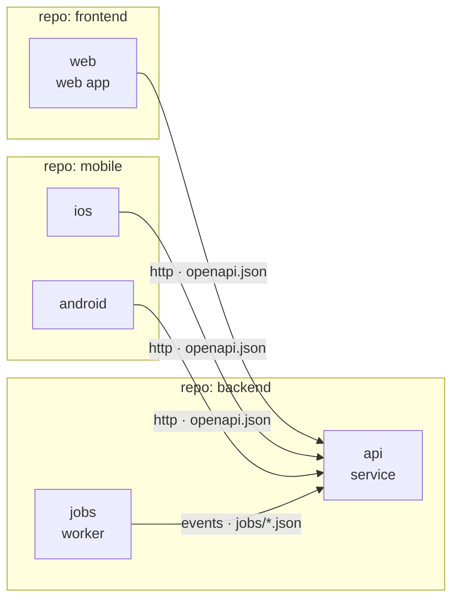
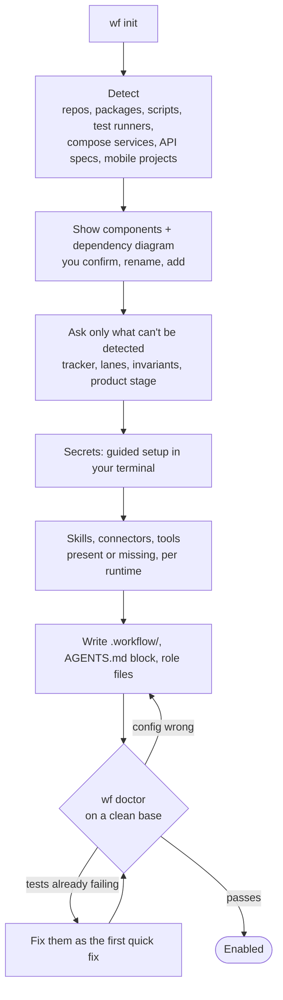
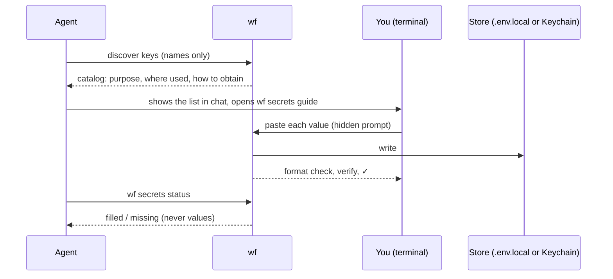

# Your system, onboarding and secrets

[Back to the README](../README.md) · [Docs map](../README.md#docs)

## Install

Requires Node.js 20+ and git.

Claude Code:

```bash
claude plugin marketplace add o-m-a-r-k/agentic-workflow
claude plugin install agentic-workflow@agentic-workflow
```

Then put the `wf` CLI on your PATH (once). The plugin is cached under a versioned folder:

```bash
node "$(ls -d ~/.claude/plugins/cache/agentic-workflow/agentic-workflow/*/ | tail -1)bin/wf" install
```

Without a plugin system, clone the repo and run `node bin/wf install`. Supported: macOS and Linux (it needs `sh`, `git` and `ps`); Windows is not supported.

## Quick start

```bash
cd my-project            # a git repo, or a folder holding several
wf init                  # drafts .workflow/ from what it finds (disabled); review it
git add .workflow && git commit -m "Add agentic-workflow adapter" && git push
wf doctor                # proves the commands work on a clean checkout of the base
wf enable
```

Or ask your agent to "onboard this project to agentic-workflow": the `onboard` skill walks you through components, steps, tracker and secrets.

## Your system: repos and components



At onboarding you define what your system is:

- **Repos** are git roots. **Packages** are folders inside a repo, for monorepos.
- **Components** are what runs: service, web, mobile-ios, mobile-android, worker, library, infra. The list is open.
- Each component declares what it `provides` and what it `dependsOn`, with the contract file: OpenAPI, proto, GraphQL or event schemas.

The engine uses this to:
- pull dependents into the gate when a contract changes;
- deliver providers before consumers;
- tell the reviewer which contracts a change crosses.

## Onboarding a project



- `wf enable` / `wf disable` turn the workflow on or off for a project at any time.
- **Engine pin.** `engine:` in the adapter is `N.x` (same major) or `>=x.y.z` (at least that release). `wf entry` and `wf gate` refuse on an engine that does not satisfy it (live adapter or the one committed at the attempt's base), naming the installed and required versions and how to upgrade; `wf doctor` reports it too. Any other form fails config validation. Pin `>=` the release whose behaviour the project relies on. The ledger records the engine version (the released version, from `package.json`) each attempt was admitted with.
- **Skills** the roles need are copied into the project when their license allows, so every agent on every runtime applies the same version.
- `wf topology` shows when the code has drifted from the committed component graph.

## Secrets



- **Agents never see a secret value.** They see key names only.
- **Only needed keys are asked for.** A key is needed when a gate step lists it in `usedBy` or the catalog marks it `required: true`; `wf secrets status` and `wf secrets guide` list every other missing key once as "not needed by any step" and print `nothing to enter` when nothing is needed. `wf init` catalogues only keys a detected step's command names and lists the rest in a comment.
- **Generated keys** (signing secrets, local database passwords) are created for you.
- **Test values** come from the project's example files.
- **Masking:** every catalogued value is masked in logs, evidence and telemetry.
